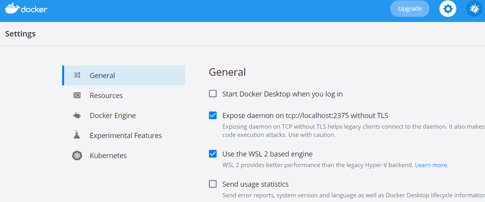
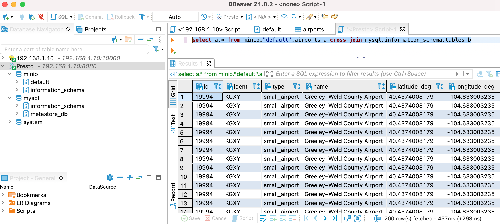
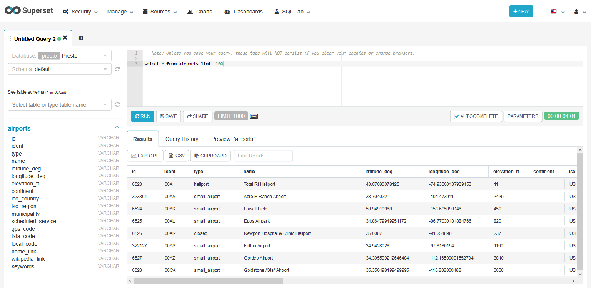
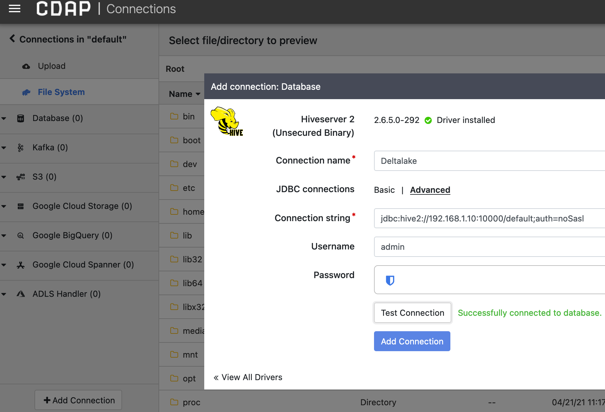

# Enterprise Data Warehouse
[Data warehouses](https://en.wikipedia.org/wiki/Data_warehouse) transform small and big businesses into digital [enterprises](https://www.forbes.com/sites/ciocentral/2012/12/28/big-data-analytics-not-just-for-big-business-anymore/): a central datum of supplier, partner, customer, sales, supply-chain, and operations information enables enterprises to describe, plan, prescribe, and preempt business plans/outcomes. 

One such enterprise -- Exate Six Cages (ESC) -- has ~2PB of enterprise data collected over last 11 years in a [Hewlett Packard Neoview](https://support.hpe.com/hpesc/public/docDisplay?docLocale=en_US&docId=c01925718) data warehouse -- a massively parallel processing (MPP) ACID engine. Neoview is now defunct (it was [decommissioned](https://www.computerworld.com/article/2512598/hp-officially-lays-neoview-to-rest.html) by Hewlett Packard in 2011). ESC finds itself wanting to rebuild its deltalake in the modern cloud than continuing to survive on aging technology and hardware. Many enterprises have similarly invested in traditional on-prem warehouse implementations like Exadata, Netezza, and Teradata: during these covid-19 induced digital-transformation times, they find themselves wanting to modernize to cloud-first deltalake implementations. Underneath, I highlight ESC's accelerated transformation journey from Neoview to [Spark](https://delta.io/) in a month. Hopefully this overview can help guide other enterprises achieve DW to DL transformation quickly.

# Bronze, Silver, Gold Zones
The legacy Neoview instance of the ESC followed the traditional bronze, silver, and gold segmentations of data and supported the full range of ACID MPP semantics. There are three parallel instances of the ESC Neoview clusters that round-robin between the (**L**)oad, (**T**)ransform, and (**E**)xtract shifts for continuous availability and durability needs -- 

 - *bronze*: the raw uncurated data lands in the raw zone (ingress staging directories) at periodic intervals of 15 minutes. These files can range in size from ~1-10GB per ingress source; there are ~50 such sources that supply this continuous data. Dimensional and other enterprise data models (are slow changing) and more glacial.
 - *silver*: the raw data is then conformed (in tables) for data quality, structural integrity, and business semantics in the refinery zone. This transformation and data curation applies once a day during the transformation stage. While most datasets are incremental (accumulative-at-the tail) or flush-and-fill (refill entirely), there are of course also mutable datasets that require in-place updates of the data in the transformation zone. Where Spark and Hive could easily address accumulation (with eventual consistency) as well as reload scenarios, the non-mutability of the block HDFS traditionally prevented fast upserts (and ACID consistency) for decent in-place delta imperatives. This is of course the BIG chasm that prevented many enterprises from conflating schema-on-read (SoR) datalakes with transactional schema-on-write (SoW) delta warehouses. 
 - *gold*: the curated data is finally summarized daily into idempotent insights in the consumption zone such that MI reports (data extracts), BI dashboards (executive insights), and AI algorithms (prescriptive scenarios) can be developed and socialized. The consistency and the durability of the consumption data could be guaranteed in the legacy environment due to explicit partitioning of the three Neoview instances into LTE roles (separated by 8 hour window-shifts) respectively: this isolation and offlining allowed for versioning and certification of insight snapshots.
 
# Size
 - There are ~50 upstream ingress sources; ~1-10GB/uncompressed-file every 15 minutes; ~96 files per-source-day
 - ~2PB total uncompressed size without any replication; ~300TB with 7x storage-compression
 - There are ~50 reporting (analytical LoB) domains; 12 functional (business units) domains
 - All data is in a single schema; ~10000 tables spread evenly across bronze, silver, and gold zones; classification of the zones is only apparent in the _lz, _rz, _cz (landing, refinery, and consumption) naming nomenclature
 - ~2000 active users (concurrency of upto 1000); ~5000 daily (scheduled) reports hosted in a self-service BI universe
 - ~1000 ad hoc direct interactive queries via ODBC bridge
 - ~2.5M lines of SQL code; ~15000 SQL Scripts; ~100K high-level statements; ~50K CRUD DML statements
 - ~100 user defined functions (UDF)
 - Direct connections via JDBC from downstream ETL egress tools
 - Direct CZ table (TB scale) replications to datamarts in Vertica
 - Ex-situ stats and data science analytics from JMP and SAS; mostly supervised regression and forecasting models
 
# Loading
Data arrives in 15 minute-batches of 0x1C-delimited-LZ4-compressed-UCS2 text files. Current legacy database allows for arrival event triggers: but given apriori agreement of 4/hr velocity, this trigger functionality is seldom used in the Neoview implementation: instead cron-based schedules kickstart the ingress pipelines.

# Structured Query Language (SQL)
Majority of loading, transformation, and extraction is written in [Neoview SQL]("https://psnow.ext.hpe.com/downloadDoc/Neoview%20SQL%20Reference%20Manual%20(R2.4)-c01932297.pdf"): albeit there is a small portion of non-standard dialect (listed below) that calls special attention. 
 1. data type definitions like [*nchar(2)*]("https://psnow.ext.hpe.com/downloadDoc/Neoview%20SQL%20Reference%20Manual%20(R2.4)-c01932297.pdf?id=c01932297&section=&prelaunchSection=&softrollSection=&deepLink=&isFutureVersion=false&isQS=false&getHtml=#i1010093") with width, scale, and precision SoW specifications
 2. transactional hints like [*for read uncommitted access in shared mode*]("https://psnow.ext.hpe.com/downloadDoc/Neoview%20SQL%20Reference%20Manual%20(R2.4)-c01932297.pdf?id=c01932297&section=&prelaunchSection=&softrollSection=&deepLink=&isFutureVersion=false&isQS=false&getHtml=#i1010464"),
 3. structural hints like [*table (disk label statistics tbl)*]("https://psnow.ext.hpe.com/downloadDoc/Neoview%20SQL%20Reference%20Manual%20(R2.4)-c01932297.pdf?id=c01932297&section=&prelaunchSection=&softrollSection=&deepLink=&isFutureVersion=false&isQS=false&getHtml=#i1064246")
 4. SQL extensions like [*year to fraction*]("https://psnow.ext.hpe.com/downloadDoc/Neoview%20SQL%20Reference%20Manual%20(R2.4)-c01932297.pdf?id=c01932297&section=&prelaunchSection=&softrollSection=&deepLink=&isFutureVersion=false&isQS=false&getHtml=#i1011631"), and [*_ucs2'你好'*]("https://psnow.ext.hpe.com/downloadDoc/Neoview%20SQL%20Reference%20Manual%20(R2.4)-c01932297.pdf?id=c01932297&section=&prelaunchSection=&softrollSection=&deepLink=&isFutureVersion=false&isQS=false&getHtml=#i1011602")
 5. Non ANSI extensions like [*transpose (a,x),(b,y),(c,z) as (k,v)*]("https://psnow.ext.hpe.com/downloadDoc/Neoview%20SQL%20Reference%20Manual%20(R2.4)-c01932297.pdf?id=c01932297&section=&prelaunchSection=&softrollSection=&deepLink=&isFutureVersion=false&isQS=false&getHtml=#i1004421")
 6. Scheme-on-write specifications like [*insert into wtbl(col1, col2, col3) select (rcol1, rcol2, rcol3) from rtbl*]("https://psnow.ext.hpe.com/downloadDoc/Neoview%20SQL%20Reference%20Manual%20(R2.4)-c01932297.pdf?id=c01932297&section=&prelaunchSection=&softrollSection=&deepLink=&isFutureVersion=false&isQS=false&getHtml=#i1008135")


# Scheduling
The transformation and the reporting pipelines use SQL. This SQL codebase was developed over a span of 11 years: since the MPP engine is in an always-on run-mode during the transformation shift -- the sequence of the SQL transformations are driven by (a homegrown C++) DTL engine -- the engine does not need any boot-strap and wind-down overhead/latencies for triggering micro-SQL statements.

Hadoop on the other hand uses yarn negotiator and oozie scheduler to bootstrap resources for the job which can accumulate into unacceptable startup delays unless a plurality of micro-SQL statements are assembled into fewer long-running DAG graphs. Forklifting SQL statements verbatim without re-assembly into bigger DAGs will essentially be a perilous yarn negotiation/queuing challenge.

# Enterprise Class
Neoview offers enterprise class fault-tolerance, logging, monitoring, alerting, debugging, security/protection, lineage/provenance, maintenance, visual editing, and auditing support. Any replacement must add to (not subtract from) these enterprise class SLAs at minima.

# <a id='requirements'>Summary Requirements</a>
The destinant deltalakehouse must -- in sum -- satisfy at least the following requirements --
 1. Provide [schema-on-read](https://aws.amazon.com/big-data/datalakes-and-analytics/what-is-a-data-lake/) flexibility (schema plasticity on ingress from heterogenous sources). Relational, non-relational, hierarchic, temporal, binary payloads should find home in the data lake.
 2. Provide [schema-on-write](https://databricks.com/blog/2019/09/24/diving-into-delta-lake-schema-enforcement-evolution.html) ACID consistency; it must enable transactional CRUD semantics at block-level and cell-level with equal ease.
 3. Provide [high-speed](https://thrift.apache.org/static/files/thrift-20070401.pdf) SQL ETL -- the full range of [SQL92](http://www.contrib.andrew.cmu.edu/~shadow/sql/sql1992.txt) compliance is preferred.
 4. Provide a lambda engine that allows both [streaming and batch](https://beam.apache.org/documentation/runners/spark/) source integration.
 5. Provide enterprise grade data [delineation](https://databricks.com/session_na20/encryption-and-masking-for-sensitive-apache-spark-analytics-addressing-ccpa-and-governance) and [protection](https://spark.apache.org/docs/latest/security.html) standards.
 6. Provide optimized [storage](https://docs.databricks.com/delta/quick-start.html), compression, and encoding formats for predicate pushdown.
 7. Provide for ad hoc, scheduled, and interactive drilldown via both [JDBC](http://data-bloom.com/notebooks/Self%20Service%20BI%20from%20Data%20Lake%20in%2010%20Minutes.html#Fire-Up-a-Thrift-Server) and [ODBC](https://docs.starburst.io/latest/installation/starburst-odbc.html) layers of integration.
 8. Provide [in-situ](https://drive.google.com/file/d/10uSyjRprlAaXRlnmfx-4alzGhICU0nMH/view?usp=sharing) advanced analytics.
 9. Provide enterprise class logging, monitoring, debugging, dataops requirements.
 
# Delta Implementation
Procuring on-prem iron for deltalake is a [challenge](https://www.cisa.gov/sites/default/files/publications/lessons-learned-during-covid-19-pandemic_508_0.pdf) during COVID times: I recommend using the [docker-compose](https://docs.docker.com/compose/) (running on localhost) to avoid slowing the development: in fact, I recommend this build for quick dataops irrespective of the procurement challenges as well. The selected serverless/storageless services in the composition allows for future-ready cloud-first deltalake implementation: we can rapidly deploy deltaops  to any cloud when the development is complete. We deep dive into the composition of the big data below.

---

# Welcome to Self-Service Analytics Docker Appliance (SSAP)

Data is king: its your data, have it your way! As you ingest, transform, curate, summarize, and consume your data, you will need handy tools and capabilities to develop your analytics. This instance of the docker compose is a "private sandbox" appliance aimed to help you quickly spin up core enterprise analytics tools on your own host: this setup will bootstrap analytical development on an accelerated basis which can ultimately be graduated into the production instance.

# Architectural Components
The SSAP is composed of [Hadoop](https://hadoop.apache.org/): a scalable, distributed big data platform and rest of its supporting ecosystem: like -  
 - [Anaconda](https://www.anaconda.com/products/individual)
 - [Pig](https://pig.apache.org)
 - [Hive](https://hive.apache.org/)
 - [Spark](https://spark.apache.org/)
 - [Flume](https://flume.apache.org/)
 - [CDAP](https://github.com/cdapio/cdap)
 - [Presto](https://prestodb.io/)
 - [Superset](https://superset.apache.org/)
 - [Airflow](https://airflow.apache.org/)
 - [Kafka](https://kafka.apache.org/)

Where these components can be selectively installed by developers, here I package a few of these applications (and their associated configurations together) into a single service composition so developers can focus on ELT, data management, refinery, consumption, analytics, and data science functions than platforming. Additionally, since majority of the ingress sources into SSAP are from Kafka (streaming) and files (batch), I prepackage notebook template guides for your own ingestion. I also demonstrate JDBC/ODBC/extract egress paths as reporting, dashboarding, extraction guides.

# Installation
To install, download and extract the [zipped package](downloads/deltalakehouse_0.3.zip) to a location on your laptop (or another docker host with at least 16GB RAM). Ensure [docker-compose](https://docs.docker.com/get-docker/) is installed on the host. If you are running this on a Windows host, download and install [Docker Desktop for Windows](https://docs.docker.com/docker-for-windows/install/). On Windows, WSL2 is preferred. See instructions at [WSL2 Installation Guide](https://docs.microsoft.com/en-us/windows/wsl/install-win10). Also ensure that docker uses [WSL2 integration](https://docs.docker.com/docker-for-windows/wsl/) for better performance.

|Enable WSL2 in Windows|
|---|
|

Subsequently, start (select) [services](https://docs.docker.com/compose/reference/up/) using -- 
 ```
docker-compose up --build
 ```
 
## *Optional*: Kompose
If you would rather run SSAP instance [in the cloud](https://cloud.google.com/kubernetes-engine/docs/how-to/cluster-access-for-kubectl), [install kompose](https://kompose.io/) and convert the docker-compose.yaml file into [kubernetes](https://kubernetes.io/) (k8s) deployment descriptions --
 1. Convert compose files into k8s yaml files using -- ```kompose convert docker-compose.yml```
 2. A multitude of yaml files (one for each service) are created from that command. Assuming all the yaml files are available in the folder *&lt;kube&gt;*, instantly spin up the pods using -- 
 ```kubectl apply --validate=false -f kube```
 3. List of all the services and deployments can be listed as --
 ```kubectl get services```
 4. If you are using microk8s instead of kubernetes (in the cloud), you have to follow instructions and [prefix kubectl with microk8s](https://microk8s.io/docs) for these instructions to work.

# Component Services
In the compose file, you will notice the following services --

|Service|Hostname|URL|Description|Credentials|
|---|---|---|---|---|
|Spark|spark|[http://&lt;dockerhost&gt;:8888/lab](http://localhost:8888/lab)|The dominant service that hosts the JupyterLab, Hive Metastore, and Spark ETL services. Developers must use this service primarily.| |
|Beeline|spark|[jdbc:hive2://&lt;dockerhost&gt;:10000/default;auth=noSasl](jdbc:hive2://localhost:10000/default;auth=noSasl)|Primary thrift/JDBC interface for running Spark/Hive DML/DDL queries.|admin/admin|
|Minio|minio|[http://&lt;dockerhost&gt;:9000/minio](http://localhost:9000/minio)|Object storage for hosting deltalakehouse models. Both relational and object models are saved to Minio (instead of HDFS).|accesskey/secretkey|
|CDAP|cdap|[http://&lt;dockerhost&gt;:11011](http://localhost:11011)|Cask Data Application Platform -- an heterogenous data integration/exploration canvas.| |
|Presto|presto|[http://&lt;dockerhost&gt;:8080](http://localhost:8080)|Presto is a distributed high-speed in-memory SQL analytical engine that can also act as a data virtualization layer. Supports JDBC, [SqlAlchemy](https://github.com/dropbox/PyHive), and ODBC (requires license)| admin/admin|
|Superset|superset|[http://&lt;dockerhost&gt;:8088](http://localhost:8088)|Superset is a cloud-based self-service BI, exploration, and visualization tool that natively integrates with big data and Presto| admin/admin|
|Airflow|airflow|[http://&lt;dockerhost&gt;:10080](http://localhost:10080)|As deltalakes manage numerous ETLR queries, it is imperative to visually schedule, manage, monitor concurrent schedules. Airflow is a workflow management/job scheduling solution for big data.| admin/admin|
|Kafka|kafka|[&lt;dockerhost&gt;:9092](kafka:9092)|Batch data arrives in files. Realtime streaming data arrives on a high-speed event message bus. Kafka is a high-performance, fault-tolerant, low-latency, distributed event streaming framework for building loosely coupled HA big data services.| SASL:PLAIN/PLAINTEXT:9092 |
|Zookeeper|zookeeper|[&lt;dockerhost&gt;:2181](zookeeper:2181)|HA services like Kafka rely on distributed discovery, monitoring, and coordination mechanism provided by [Apache Zookeeper](http://zookeeper.apache.org). | |

# Docker
It is intended that the majority of the developer interaction is in the *spark* container. To see all docker services and their container IDs, use -- 
```
docker ps # check docker containers
```
 
Only one instance/service is created by default: if you wish to scale a service with replicas, you can spin more with the docker-compose scale command. Ensure enough [port-ranges are published](https://medium.com/@karthi.net/how-to-scale-services-using-docker-compose-31d7b83a6648) in the compose yml file to allow replicas to service application requests.
 ```
 docker-compose up -d --scale minio=2 --scale presto=3 
 ```

# [Jupyter](http://localhost:8888)
Jupyter is running on 8888. The password is empty. If you want to reset the password, you can choose to set the password as 
 ```
# On the host prompt
docker exec -it <container_id_of_spark> bash

# On the container prompt
jupyter notebook --generate-config
echo "c.NotebookApp.token = u'<PASSWORD>'" >> ~/.jupyter/jupyter_notebook_config.py
exit
 
 # On the host prompt again
docker restart <container_id_of_spark>
 ```
Both new Jupyter Lab and classic Jupyter Notebook interfaces are implemented at [http://&lt;dockerhost&gt;:8888/lab](http://localhost:8888/lab) and [http://&lt;dockerhost&gt;:8888/tree](http://localhost:8888/tree) respectively. 

The composition -- on first bootstrap -- comes empty. There is a pre-supplied [SparkStart.ipynb](http://localhost:8888/notebooks/SparkStart.ipynb) notebook in the */notebooks* folder that will fetch airports/IATA data from the web and [create a *default.airports* table](downloads/SparkResult.html) in the warehouse. Services such as Superset contain a prebuilt [Airports Dashboard](http://localhost:8088/superset/dashboard/1/) that relies on an *airports* dataset in the *default* schema of Hive.

|Jupyter Tree/Lab Interface|
|---|
||
||

You can open a development terminal (to run Java, Maven, Git, Spark, Hive, Hadoop, Flume etc) using one of the two options below -- 
 - first, choose *New &rarr; Terminal* option from the Jupyter notebook interface
 - second, open container terminal using *docker exec -it &lt;container_id_of_spark&gt; bash* from the host terminal.

<a id='thrift'></a>
# Hive
Hive is available in the spark container. In reality, *hive* is a pre-defined alias for *spark-sql*. To issue hive command, you may either use CLI terminal in the notebook or use --
 ```
# On the host terminal
docker exec -it <spark_container_id> hive
 ```
The thriftserver is also running on port 10000. I used simple binary thrift interface to service client requests. If you want to emulate HTTP interface (because you wish to implement [knox gateway](https://knox.apache.org/)), you may also use HiveServer2 via HTTP transport mode. Current thriftserver is defined as *binary* as following in the *sparkbox/entrypoint.sh* -- 

Binary Interface <a id='yarn'></a>
```
${SPARK_HOME}/sbin/start-thriftserver.sh --master=local[1] --driver-memory=1g \
    --hiveconf hive.server2.thrift.bind.host=0.0.0.0 \
    --hiveconf hive.server2.thrift.port=10000 \
    --hiveconf hive.server2.authentication=NOSASL \
    --conf "spark.sql.extensions=io.delta.sql.DeltaSparkSessionExtension" \
    --conf "spark.sql.catalog.spark_catalog=org.apache.spark.sql.delta.catalog.DeltaCatalog"
```
or HTTP Interface

```
${SPARK_HOME}/sbin/start-thriftserver.sh --master=local[1] --driver-memory=1g \
    --hiveconf hive.server2.thrift.bind.host=0.0.0.0 \
    --hiveconf hive.server2.transport.mode=http \
    --hiveconf hive.server2.thrift.http.port=10000 \
    --hiveconf hive.server2.http.endpoint=cliservice \
    --conf "spark.sql.extensions=io.delta.sql.DeltaSparkSessionExtension" \
    --conf "spark.sql.catalog.spark_catalog=org.apache.spark.sql.delta.catalog.DeltaCatalog"
```

You can use standard tools like [DBeaver](https://dbeaver.io/download/) to explore Hive catalog. The standard [Hive JDBC driver](https://github.com/timveil/hive-jdbc-uber-jar/releases/download/v1.9-2.6.5/hive-jdbc-uber-2.6.5.0-292.jar) works well with Spark.

|Binary JDBC Protocol|HTTP JDBC Protocol|
|---|---|
|||

Notice that the spark thriftserver was bootstrapped with *delta* extensions so mutable delta queries will work out-of-the-box.

|Updates allowed on Spark Deltalake|
|---|
||

You can also use ODBC drivers to connect Microsoft [PowerBI](https://powerbi.microsoft.com/en-us/get-started/)/Excel to Hive. Cloudera (or Simba, CDATA) ask for a freemium [license](https://www.cloudera.com/downloads/connectors/hive/odbc/2-6-1.html) to enable ODBC functionality.

|Spark PowerBI Connection|ODBC Access to Spark|
|---|---|
|||

You can use *DirectQuery* option to pushdown queries to Hive/Spark.

|Sample [PowerBI Dashboard](downloads/Airports_Sample.pbix)|
|---|
|[](downloads/Airports_Sample.pbix)|

Additionally, you can use [sqlalchemy](https://www.sqlalchemy.org/) (via [pyhive](https://pypi.org/project/PyHive/) module) to query Hive tables directly as well. Spark, of course, can also read hive tables using standard *spark.table('default.airports')* syntax.

|Query Hive/Spark directly from notebook|
|---|
|[](http://localhost:8888/notebooks/SparkStart.ipynb#Spark-Beeline)|

## [Presto](http://localhost:8080/ui)
Presto has two flavors -- [PrestoDB](https://prestodb.io/) and [Trino](https://trino.io/) -- two very similar but forked differently by original Presto contributors. I used the [Starburst](https://hub.docker.com/r/starburstdata/presto) Presto image in the composition file.

Presto is a high performance, distributed SQL query engine for big data. Its architecture allows users to query a variety of data sources such as Hadoop, S3, GCS, Azure, MySQL, Cassandra, Kafka, and MongoDB. In fact, [any generic JDBC](https://github.com/tooptoop4/presto-1/tree/lightgenjdbc/presto-genericjdbc) will work although it is not enabled in the docker composition. Presto can also query data from multiple data sources within a single query (virtualization). This data virtualization layer -- along with its high speed pipelined execution engine -- really makes Presto a pivotal element to integrate heterogenous service surface of SSAP appliance: it makes catalogs of SQL Server, Vertica, Postgres, Hive, S3, Kafka etc seamlessly appear as a single data asset without physical data movement.

|Presto DBeaver Configuration|Speedy Cross Database Queries with Presto|
|---|---|
|||

|Querying Hive/Spark|Querying Presto|
|---|---|
|||

You can also of course use ODBC drivers to connect PowerBI/Excel tools to Presto. I do not have a free ODBC driver (PowerBI only works with ODBC sources) for Presto, so unless you have an [enterprise license](https://docs.starburst.io/latest/installation/starburst-odbc.html) for CData, Simba, or Starburst Presto ODBC drivers, the PBI based interaction with Presto is unfortunately limited.

To query Presto from the notebook, [pyhive](https://pypi.org/project/PyHive/) connectors are pre-installed in the container.

|Query Presto directly from notebook|
|---|
|[](http://localhost:8888/notebooks/SparkStart.ipynb#Presto)|

Currently presto is only configured with the local Hive Catalog (running atop Minio object storage), but since Presto supports many more data sources like GCP, Kafka, MySQL, SQLServer, Postgres, Accumulo, Redshift, ElasticSearch, Log Files etc, you may add more catalogs to Presto by following [Connector Guides](https://prestodb.io/docs/current/connector.html) documentation. The *catalog* folder in the root namespace of the docker host can be modified to accommodate new connector catalogs.

# [Superset](http://localhost:8088/)
[Superset](https://superset.apache.org/) is an Apache licensed open-source cloud BI solution that supports -
 - importing data from a diverse set of data sources
 - exploring data in-place through interactive SQL queries
 - building compelling BI visualizations

Of particular note are three sections --
 - [Data Sources](http://localhost:8088/databaseview/list/) where databases and tables -- presumably external connections to a myriad of data sources  -- are added. Presto, Deltalake (Spark) sources etc have already been added to the superset catalog. In addition, if one chooses to add ad hoc CSV files to the BI query, this section allows for ad hoc file uploads.

|Presto Connection in Superset|Spark Connection in Superset|
|---|---|
|||

 - [SQL Lab](http://localhost:8088/superset/sqllab) is an interactive inline SQL editor to query data from data sources.

|Query Databases from Superset|
|---|
||

 - [Charts & Dashboards](http://localhost:8088/chart/list/) is an interactive visualization builder to allow for authoring and embedding rich visualizations into socialized dashboards.

|Build and socialize dashboards in Superset|
|---|
||

# [CDAP](http://localhost:11011/cdap/ns/default)
Cask Data Application Platform (CDAP) is an open source application development platform for Hadoop. It addresses a broad range of real-time and batch data integration needs with a visual canvas. It provides seamless assemblage and devops of complex pipelines into production. Cask, now owned by Google, offers managed code-free data integration services (as [Google Cloud Fusion](https://cloud.google.com/data-fusion) in the GCP platform). We integrate the free open-source version into our SSAP appliance.

## [Wrangler](http://localhost:11011/cdap/ns/default/wrangler)
Wrangler is a visual canvas to explore, cleanse, shape, profile, and enrich a variety of data sources (like databases, Kafka streams). You should be able to import (*add connection*) from data sources and quickly shape, describe, cleanse, and infer data quality.

|Add data connection|Explore Data|
|---|---|
|||


## [Replication](http://localhost:11011/cdap/ns/default/replication)
CDAP's Replicate module makes it easy to replicate live data from operational databases like MySQL, SQl Server, Oracle, SAP HANA etc into big data environment like Hadoop. For anyone that has attempted to do this manually, the chore of maintaining waterline markers, ensuring idempotent changes, and designing monotonic index columns, change logs, parallel sharding of data replication etc can be daunting. The replication module makes table level "follow-changes" semantics easy to implement on Hadoop.

|Enable realtime replication from Operational Stores to Deltalake|
|---|
||

## Hub
CDAP's Hub offers a single managed interface to import, integrate, and leverage myriad of cloud services and databases. If there is not an already provisioned visual icon to integrate data (say Marketo or Anaplan), there are [CDAP connectors](https://github.com/data-integrations) that can be easily downloaded and configured into CDAP.

|Add myriad of plugins, sources, and databases on the fly|
|---|
||

## [Studio](http://localhost:11011/pipelines/ns/default/studio)
CDAP's Studio -- the core competency of CDAP -- is a visual ETL canvas for quickly assembling complex extract-transform-load (source-wrangle-sink) routines graphically; optionally you can also deploy these pipelines for either real-time or batch integration. Data engineers can schedule pipelines and attach alerts/triggers from the same canvas. Draft pipelines can also be replicated, saved, shared, undeployed from the [*List*](http://localhost:11011/cdap/ns/default/pipelines) view.

|Develop complex data pipelines visually in CDAP Studio|
|---|
||

# [Airflow](http://localhost:10080)
[Apache Airflow](https://airflow.apache.org/) is an open-source workflow management platform written completely in Python by AirBnB. Airflow allows data engineers to programmatically author, schedule, and monitor their workflows via an user interface. Additionally, Airflow offers a multitude of data integration/connectors (ala CDAP) to cloud like SFDC, GCP, AWS, and Azure. While there is some redundancy in process-flow and data-flow authoring/monitoring between CDAP Studio and Airflow, I combine both these services in the composition to allow flexibility/choice for the users. Google offers a managed airflow service, much as Amazon, under [Google Cloud Composer](https://cloud.google.com/composer) branding.

Airflow schedules and executes jobs in "DAGs" (directed acyclic graph) -- a composition of tasks. A sample DAG -- below -- looks as following when airflow automatically (watches and) picks up the [*Example_DAG.py*](https://github.com/apache/airflow/blob/master/airflow/example_dags/tutorial_etl_dag.py) from the *${AIRFLOW_HOME}/dags* (mounted from the host's *airflow/dags*) folder.

|Directed Acyclic Jobs (composition of tasks) scheduled by Airflow|
|---|
||


# Flume
[Apache Flume](http://flume.apache.org) is a reliable, durable, and highly available transport bus for implementing complex enterprise integration patterns. Flume makes collecting, transforming, and storing large amounts of continuous and batch datasets into simple pipelines. Furthermore, it is possible to cascade multiple pipelines into complex, distributed orchestrations with inbuilt flexible fault-tolerant policies. Flume is installed as a simple binary in the composition. Later, we show how ESC uses Flafka and Flume to integrate realtime Kafka and File sources respectively. CDAP already provides ingressing these beam (batch + streaming) sources visually, albeit some integrations are best handled via command line services like Flume.

# [Minio](http://localhost:9000/minio)
[Minio](https://github.com/minio/minio) is an open-source high-performance S3-compatible object-storage implementation that provides inbuilt scaling, replication, versioning, locking & concurrency controls, and [erasure coding](https://docs.min.io/docs/minio-erasure-code-quickstart-guide.html).

Where HDFS offers scaling and [erasure coding](https://blog.cloudera.com/introduction-to-hdfs-erasure-coding-in-apache-hadoop/), the prior assignment of the storage to HDFS preempts other uses/services. Multiple enterprises/clouds now offer storageless solutions: preempting a dedicated quota apriori for HDFS is not optimal considering majority of the workloads (including [location aware MPP](https://www.researchgate.net/publication/254038524_Investigation_of_Data_Locality_in_MapReduce) primitives) are now moving to serverless (ephemeral/short-lived container) solutions like Amazon's [EMR](https://aws.amazon.com/emr/) and Google's [DataProc](https://cloud.google.com/dataproc). Since Minio can seamlessly [gateway](https://docs.min.io/docs/minio-gateway-for-azure.html) to existing HDFS, NFS, and cloud buckets just as easily as striping object models across physical disks, I recommend switching to the object storage bandwagon now: you can transition existing HDFS implementations via the gateway pattern if needed. 

Despite my first resistance, [Vamsi Paladugu](https://www.linkedin.com/in/vamsi-paladugu-8548364) is a visionary who convinced me -- in 2019 -- that these serverless/storageless k8s/object-storage models are indeed the future-state deltalakes.

I enable simple object storage in the composition via managed docker volumes. Two buckets are created apriori upon boot -- *hdfs* & *spark*. Minio buckets can be acessed/managed visually via [minio UI](http://localhost:9000/minio/). From CLI --
```
# minio is the host alias defined as following in the composition
# MINIO_HOST=minio:9000
# ACCESS_KEY=accesskey
# SECRET_KEY=secretkey

mc alias set minio ${MINIO_HOST} ${ACCESS_KEY} ${SECRET_KEY} --api S3v4

# Manipulate objects and buckets on minio
mc ls minio/            # List buckets
mc mb -p minio/spark    # Make a bucket
mc tree minio/spark     # List tree hierarchically
```

The composition defines both *spark.sql.warehouse.dir* and *hive.metastore.warehouse.dir* as *s3a://spark/warehouse/* in the *core-site.xml* -- so both delta and (un)managed tables land on the spark bucket. The *fs.s3a.endpoint* is defined as *http://minio:9000/*. Where a sample delta table is defined as following, the objects on s3a are shown below -- 
```
-- Spark DDL
CREATE TABLE airports_delta LIKE airports 
USING delta 
LOCATION 's3a://spark/warehouse/airports_delta';

```

|Table data stored as objects in the spark bucket on Minio|
|---|
||


Furthermore, the property *fs.s3a.impl* is defined as *org.apache.hadoop.fs.s3a.S3AFileSystem* in the *core-site.xml*. This enables you to manage (copy, delete, move, create) *s3a* namespace via HDFS commands --

```
hadoop fs -ls s3a://spark/*     # spark is the bucket name

# To copy files between file systems (including distcp)
hadoop fs -cp images/minio_objects.png s3a://hdfs/

hadoop fs -ls -R s3a://spark/    # To list files using HDFS tools
```
---

# Copy-Exact vs Refactor
Existing codebase in ESC's Neoview EDW -- built over last 11 years -- must be converted to new deltalake on Spark 3. ESC chose to first refactor the entire business logic (BLOC) again -- but was daunted by the size of the effort. The manual analysis, reauthorship, buyin from the business domains are overwhelming considering Dexcan Consultants (ESC's IT partner) provided a very short lease of support (under 6 months) to cutover the Neoview servers to Spark. I recommended using copy-exact method instead; I built tools to automate the translation of existing BLOC into Spark ANSI SQL while also ensuring the said [requirements](#requirements) are fulfilled.

To illustrate the automation, and to protect ESC's IP here, I use [sample queries](https://github.com/jesimone57/sql_music_examples/blob/master/mysql) to demonstrate DDL, DML, reporting, and airflow reconstruction on the deltalake. The queries are slightly adapted (augmented) for better coverage. The modified files are available in the *[sql_queries](sql_queries/)* folder.

# Spark Translator Preamble


```python
import ast
import atexit
import io
import itertools
import json
import os
import re
import sys
import uuid

import pandas as pd
import qgrid
from IPython.display import HTML, display
from ipywidgets import Button, Dropdown, HBox, Layout, Output, Textarea, VBox

pd.options.mode.chained_assignment = None
from datetime import datetime

if "spark" not in vars():
    import findspark

    findspark.init()
    import pyspark.sql.functions as F
    import pyspark.sql.types as T
    from pyspark.sql import DataFrame, SparkSession
    from pyspark.sql.window import Window
    from pyspark.storagelevel import StorageLevel

    spark = (
        SparkSession.builder.master("local[8]")
        .config("spark.jars.packages", "io.delta:delta-core_2.12:0.8.0")
        .config("spark.sql.extensions", "io.delta.sql.DeltaSparkSessionExtension")
        .config(
            "spark.sql.catalog.spark_catalog",
            "org.apache.spark.sql.delta.catalog.DeltaCatalog",
        )
        .config("spark.driver.memory", "2g")
        .config("spark.sql.shuffle.partitions", 16)
        .config("spark.sql.sources.bucketing.enabled", False)
        .enableHiveSupport()
        .getOrCreate()
    )
    atexit.register(lambda: spark.stop())

import pyspark.sql.functions as F
import pyspark.sql.types as T
from pyspark.sql import DataFrame, Row, SparkSession
from pyspark.sql.window import Window


def cleanse_val(val):
    return re.sub(r"([^\s\w\d])+", "", val.lower()).strip() if val else ""


def reg(spark_df, name=None):
    uniqsig = "df_{0}".format(cleanse_val(str(uuid.uuid4()))) if not name else name
    spark_df.createOrReplaceTempView(uniqsig)
    return uniqsig


def show(df, rows=5):
    display(df.limit(rows).toPandas())


DataFrame.reg = reg
DataFrame.dshow = show

display(spark)
```


    <div>
        <p><b>SparkSession - hive</b></p>

<div>
    <p><b>SparkContext</b></p>

    <p><a href="http://514923e53378:4041">Spark UI</a></p>

    <dl>
      <dt>Version</dt>
        <dd><code>v3.1.1</code></dd>
      <dt>Master</dt>
        <dd><code>local[8]</code></dd>
      <dt>AppName</dt>
        <dd><code>pyspark-shell</code></dd>
    </dl>
</div>

    </div>


Spark context is created. The UI should be visible at port [http://&lt;dockerhost&gt;[4040-4043]](http://localhost:4041)

# Load SQL Queries
Read the as-is codebase


```python
import glob
import os

import pandas as pd
import sqlparse


# Read file contents a string
def read_file_contents(filename):
    with open(filename, "r") as f:
        return f.read().strip()


# Scan the code folder for all SQL queries
code_pd = pd.DataFrame(
    [
        (filename, read_file_contents(filename))
        for filename in glob.glob(f"sql_queries/*.sql")
    ],
    columns=["File", "Code"],
)
# Assign a unique ID to every script file
code_pd["ScriptID"] = code_pd.apply(lambda x: 1 + x.name, axis=1)
# Build a spark data frame and display
code_csv = spark.createDataFrame(code_pd)

code_csv.dshow()
```


<div>

<table border="1" class="dataframe">
  <thead>
    <tr style="text-align: right;">
      <th></th>
      <th>File</th>
      <th>Code</th>
      <th>ScriptID</th>
    </tr>
  </thead>
  <tbody>
    <tr>
      <th>0</th>
      <td>sql_queries/SQL02.sql</td>
      <td>USE music;\n-- Artist table\nCREATE TABLE arti...</td>
      <td>1</td>
    </tr>
    <tr>
      <th>1</th>
      <td>sql_queries/SQL01.sql</td>
      <td>-- A sample comment\nCREATE DATABASE IF NOT EX...</td>
      <td>2</td>
    </tr>
    <tr>
      <th>2</th>
      <td>sql_queries/SQL03.sql</td>
      <td>-- 1. List all artists for each record label s...</td>
      <td>3</td>
    </tr>
    <tr>
      <th>3</th>
      <td>sql_queries/SQL04.sql</td>
      <td>-- A sample comment\nCREATE DATABASE IF NOT EX...</td>
      <td>4</td>
    </tr>
  </tbody>
</table>
</div>


# Metadata in Queries
Extract headers, collate lines. Headers contain some importanr info like developers, dates, RFC etc.


```python
# Comments are anything that succeeds double -- signature
comment_signature = re.compile(
    r"^.*?(?=[\-]{2,})([^$]+)"
)  # Capture comment portion only

# Capture all comments using simple Regex
scan_comment = (
    lambda line: [cmt.lstrip("-") for cmt in re.findall(comment_signature, line) if cmt]
    if line
    else []
)

# Find comments across all lines
def collect_comment(lines):
    return (
        "\n".join(
            list(
                itertools.chain(
                    *[
                        c
                        for c in [
                            scan_comment(line)
                            for line in lines.split("\n")
                            if line.strip().lower() != "(null)"
                        ]
                        if c
                    ]
                )
            )
        )
        if lines
        else None
    )


# Project comments from Code column
code_comments = code_csv.withColumn("Comments", F.udf(collect_comment)("Code"))
code_comments.dshow()
```


<div>

<table border="1" class="dataframe">
  <thead>
    <tr style="text-align: right;">
      <th></th>
      <th>File</th>
      <th>Code</th>
      <th>ScriptID</th>
      <th>Comments</th>
    </tr>
  </thead>
  <tbody>
    <tr>
      <th>0</th>
      <td>sql_queries/SQL02.sql</td>
      <td>USE music;\n-- Artist table\nCREATE TABLE arti...</td>
      <td>1</td>
      <td>Artist table\n Clear out the table\n Robert M...</td>
    </tr>
    <tr>
      <th>1</th>
      <td>sql_queries/SQL01.sql</td>
      <td>-- A sample comment\nCREATE DATABASE IF NOT EX...</td>
      <td>2</td>
      <td>A sample comment\n More comment\n Switch data...</td>
    </tr>
    <tr>
      <th>2</th>
      <td>sql_queries/SQL03.sql</td>
      <td>-- 1. List all artists for each record label s...</td>
      <td>3</td>
      <td>1. List all artists for each record label sor...</td>
    </tr>
    <tr>
      <th>3</th>
      <td>sql_queries/SQL04.sql</td>
      <td>-- A sample comment\nCREATE DATABASE IF NOT EX...</td>
      <td>4</td>
      <td>A sample comment\n Switch database\n Read data</td>
    </tr>
  </tbody>
</table>
</div>


```python
import spacy
from dateutil.parser import parse
# use spacy model
nlp = spacy.load("en_core_web_sm")

# Format the date as ISO
def try_parse(datestr):
    try:
        return parse(datestr, fuzzy=True).strftime("%Y-%m-%d")
    except:
        None


# Scan all occurences of dates in the content
def parse_dates(txt):
    return (
        [
            dt
            for dt in [
                try_parse(tok.text)
                for tok in nlp(txt).ents
                if tok.label_ in ["DATE", "TIME"]
            ]
            if dt
        ]
        if txt
        else []
    )


# Scan all occurences of people names in the content
def parse_people(txt):
    return (
        list(
            map(
                str,
                set(
                    [
                        pp
                        for pp in [
                            tok.text
                            for tok in nlp(txt).ents
                            if tok.label_ in ["PERSON"]
                            and "_" not in tok.text
                            and 4 <= len(tok.text) <= 36
                        ]
                        if pp
                    ]
                ),
            )
        )
        if txt
        else []
    )


# Create a UDF wrapper of Python function
array_udf = lambda fn: F.udf(
    fn, T.ArrayType(T.StringType())
)  # This UDF returns an array of Strings

code_intel = code_comments.withColumn(
    "Notable_Dates", array_udf(parse_dates)("Comments")
).withColumn("Potential_Developers", array_udf(parse_people)("Comments"))
code_intel.dshow(5)
```


<div>

<table border="1" class="dataframe">
  <thead>
    <tr style="text-align: right;">
      <th></th>
      <th>File</th>
      <th>Code</th>
      <th>ScriptID</th>
      <th>Comments</th>
      <th>Notable_Dates</th>
      <th>Potential_Developers</th>
    </tr>
  </thead>
  <tbody>
    <tr>
      <th>0</th>
      <td>sql_queries/SQL02.sql</td>
      <td>USE music;\n-- Artist table\nCREATE TABLE arti...</td>
      <td>1</td>
      <td>Artist table\n Clear out the table\n Robert M...</td>
      <td>[2022-05-01]</td>
      <td>[Robert Miller]</td>
    </tr>
    <tr>
      <th>1</th>
      <td>sql_queries/SQL01.sql</td>
      <td>-- A sample comment\nCREATE DATABASE IF NOT EX...</td>
      <td>2</td>
      <td>A sample comment\n More comment\n Switch data...</td>
      <td>[]</td>
      <td>[]</td>
    </tr>
    <tr>
      <th>2</th>
      <td>sql_queries/SQL03.sql</td>
      <td>-- 1. List all artists for each record label s...</td>
      <td>3</td>
      <td>1. List all artists for each record label sor...</td>
      <td>[2021-04-26, 2021-04-26, 2021-04-12, 2021-04-2...</td>
      <td>[]</td>
    </tr>
    <tr>
      <th>3</th>
      <td>sql_queries/SQL04.sql</td>
      <td>-- A sample comment\nCREATE DATABASE IF NOT EX...</td>
      <td>4</td>
      <td>A sample comment\n Switch database\n Read data</td>
      <td>[]</td>
      <td>[]</td>
    </tr>
  </tbody>
</table>
</div>


# Analyze SQL Script

A script can contain multiple statements and comments. Rip and analyze these statements sequentially.


```python
import sqlparse


# First strip out all comments and whitespace
# and reformat the SQL script
def format_sql(sql):
    return (
        sqlparse.format(
            str(sql),
            reindent=True,
            keyword_case="upper",
            strip_comments=True,
            use_space_around_operators=True,
            strip_whitespace=True,
        )
        if sql
        else None
    )


# For each statement (aka CRUD query), categorize based on first token
def parse_statement(stmt):
    try:
        return (
            (str(stmt.token_first()).split()[0].upper(), str(stmt))
            if stmt and stmt.tokens
            else None
        )
    except:
        return None


# For a compound script (multitude of CRUD statements), sequentially format and analyze statement composition
def rip_query(sql):
    def safe_parse(sql):
        try:
            # Clean syntax
            return sqlparse.parse(format_sql(sql)) if sql else []
        except:
            return []

    # Analyze each statement of the script
    return [parse_statement(stmt) for stmt in safe_parse(sql) if stmt] if sql else []


# Wrap the rip_query into a Spark UDF
sqlparse_udf = F.udf(
    rip_query,
    T.ArrayType(
        T.StructType(
            [
                T.StructField("Statement_Type", T.StringType()),
                T.StructField("Statement_SQL", T.StringType()),
            ]
        )
    ),
)

# Rip all scripts and explode individual statements in sequence
code_statements = (
    code_intel.select(
        "*", F.posexplode(sqlparse_udf("Code")).alias("Statement_ID", "Statement")
    )
    .withColumnRenamed("Code", "OriginalSQL")
    .withColumn("Statement_Type", F.expr("Statement.Statement_Type"))
    .withColumn(
        "SqlStatement",
        F.udf(lambda x: x.strip() if x else x)(F.expr("Statement.Statement_SQL")),
    )
    .withColumn("Statement_ID", F.expr("Statement_ID + 1"))
    .withColumn(
        "UseDatabase",
        F.udf(
            lambda x: re.sub(
                r"(?:USE)\s+([^\b;]+)[\b;]", r"\1", str(x), flags=(re.I | re.M)
            ).strip()
            if x and "use " in str(x).lower()
            else None
        )("SqlStatement"),
    )
    .withColumn(
        "UseDatabase",
        F.coalesce(
            F.last("UseDatabase", ignorenulls=True).over(
                Window.partitionBy("File", "ScriptID").orderBy(
                    F.col("Statement_ID").asc()
                )
            ),
            F.lit("default"),
        ),
    )
    .withColumn("UseDatabase", F.trim("UseDatabase"))
    .drop("Statement")
    .drop("OriginalSQL")
)

code_statements.dshow(5)
```


<div>

<table border="1" class="dataframe">
  <thead>
    <tr style="text-align: right;">
      <th></th>
      <th>File</th>
      <th>ScriptID</th>
      <th>Comments</th>
      <th>Notable_Dates</th>
      <th>Potential_Developers</th>
      <th>Statement_ID</th>
      <th>Statement_Type</th>
      <th>SqlStatement</th>
      <th>UseDatabase</th>
    </tr>
  </thead>
  <tbody>
    <tr>
      <th>0</th>
      <td>sql_queries/SQL03.sql</td>
      <td>3</td>
      <td>1. List all artists for each record label sor...</td>
      <td>[2021-04-26, 2021-04-26, 2021-04-12, 2021-04-2...</td>
      <td>[]</td>
      <td>1</td>
      <td>SELECT</td>
      <td>SELECT ar.name "Artist Name",\n       r.name "...</td>
      <td>default</td>
    </tr>
    <tr>
      <th>1</th>
      <td>sql_queries/SQL03.sql</td>
      <td>3</td>
      <td>1. List all artists for each record label sor...</td>
      <td>[2021-04-26, 2021-04-26, 2021-04-12, 2021-04-2...</td>
      <td>[]</td>
      <td>2</td>
      <td>SELECT</td>
      <td>SELECT r.name `Record Label Name`\nFROM record...</td>
      <td>default</td>
    </tr>
    <tr>
      <th>2</th>
      <td>sql_queries/SQL03.sql</td>
      <td>3</td>
      <td>1. List all artists for each record label sor...</td>
      <td>[2021-04-26, 2021-04-26, 2021-04-12, 2021-04-2...</td>
      <td>[]</td>
      <td>3</td>
      <td>SELECT</td>
      <td>SELECT ar.name "Artist Name",\n       count(*)...</td>
      <td>default</td>
    </tr>
    <tr>
      <th>3</th>
      <td>sql_queries/SQL03.sql</td>
      <td>3</td>
      <td>1. List all artists for each record label sor...</td>
      <td>[2021-04-26, 2021-04-26, 2021-04-12, 2021-04-2...</td>
      <td>[]</td>
      <td>4</td>
      <td>SELECT</td>
      <td>SELECT ar.name "Artist Name",\n       count(*)...</td>
      <td>default</td>
    </tr>
    <tr>
      <th>4</th>
      <td>sql_queries/SQL03.sql</td>
      <td>3</td>
      <td>1. List all artists for each record label sor...</td>
      <td>[2021-04-26, 2021-04-26, 2021-04-12, 2021-04-2...</td>
      <td>[]</td>
      <td>5</td>
      <td>SELECT</td>
      <td>SELECT ar.name "Artist Name",\n       count(*)...</td>
      <td>default</td>
    </tr>
  </tbody>
</table>
</div>


# View Query Statement Spread

For all the given queries, visualize the DDL (Create Statements), DML (Insert/Update/Delete Statements), and Reporting (Select statements) Spread.


```python
df = (
    code_statements.select("Statement_Type")
    .toPandas()
    .value_counts()
    .to_frame("Statement_Count")
    .reset_index()
)
display(df)
import plotly.express as px

#fig = px.pie(df, names="Statement_Type", values="Statement_Count")
#fig.show()
display(HTML(""))
```


<div>

<table border="1" class="dataframe">
  <thead>
    <tr style="text-align: right;">
      <th></th>
      <th>Statement_Type</th>
      <th>Statement_Count</th>
    </tr>
  </thead>
  <tbody>
    <tr>
      <th>0</th>
      <td>INSERT</td>
      <td>66</td>
    </tr>
    <tr>
      <th>1</th>
      <td>SELECT</td>
      <td>21</td>
    </tr>
    <tr>
      <th>2</th>
      <td>CREATE</td>
      <td>7</td>
    </tr>
    <tr>
      <th>3</th>
      <td>USE</td>
      <td>3</td>
    </tr>
    <tr>
      <th>4</th>
      <td>DELETE</td>
      <td>1</td>
    </tr>
    <tr>
      <th>5</th>
      <td>PURGEDATA</td>
      <td>1</td>
    </tr>
    <tr>
      <th>6</th>
      <td>SHOW</td>
      <td>1</td>
    </tr>
    <tr>
      <th>7</th>
      <td>UPDATE</td>
      <td>1</td>
    </tr>
  </tbody>
</table>
</div>


# DDL Definitions

Before copying-exact from Neoview tables and SQLs, I will need to create target table structures in Spark to map 1:1. I must capture all data definition templates (aka *CREATE TABLE* statements). A proper destinant receptacle of original structures is needed first.


```python
# Select DDL definitions only
create_statements = code_statements.filter('Statement_Type == "CREATE"')
# Show
create_statements.dshow(5)
```


<div>

<table border="1" class="dataframe">
  <thead>
    <tr style="text-align: right;">
      <th></th>
      <th>File</th>
      <th>ScriptID</th>
      <th>Comments</th>
      <th>Notable_Dates</th>
      <th>Potential_Developers</th>
      <th>Statement_ID</th>
      <th>Statement_Type</th>
      <th>SqlStatement</th>
      <th>UseDatabase</th>
    </tr>
  </thead>
  <tbody>
    <tr>
      <th>0</th>
      <td>sql_queries/SQL02.sql</td>
      <td>1</td>
      <td>Artist table\n Clear out the table\n Robert M...</td>
      <td>[2022-05-01]</td>
      <td>[Robert Miller]</td>
      <td>2</td>
      <td>CREATE</td>
      <td>CREATE TABLE artist (id int unsigned NOT NULL,...</td>
      <td>music</td>
    </tr>
    <tr>
      <th>1</th>
      <td>sql_queries/SQL02.sql</td>
      <td>1</td>
      <td>Artist table\n Clear out the table\n Robert M...</td>
      <td>[2022-05-01]</td>
      <td>[Robert Miller]</td>
      <td>13</td>
      <td>CREATE</td>
      <td>CREATE TABLE album (id int unsigned NOT NULL,\...</td>
      <td>music</td>
    </tr>
    <tr>
      <th>2</th>
      <td>sql_queries/SQL02.sql</td>
      <td>1</td>
      <td>Artist table\n Clear out the table\n Robert M...</td>
      <td>[2022-05-01]</td>
      <td>[Robert Miller]</td>
      <td>28</td>
      <td>CREATE</td>
      <td>CREATE TABLE song (id int unsigned NOT NULL,\n...</td>
      <td>music</td>
    </tr>
    <tr>
      <th>3</th>
      <td>sql_queries/SQL04.sql</td>
      <td>4</td>
      <td>A sample comment\n Switch database\n Read data</td>
      <td>[]</td>
      <td>[]</td>
      <td>1</td>
      <td>CREATE</td>
      <td>CREATE DATABASE IF NOT EXISTS stocks;</td>
      <td>default</td>
    </tr>
    <tr>
      <th>4</th>
      <td>sql_queries/SQL04.sql</td>
      <td>4</td>
      <td>A sample comment\n Switch database\n Read data</td>
      <td>[]</td>
      <td>[]</td>
      <td>3</td>
      <td>CREATE</td>
      <td>CREATE TABLE ticker (symbol string,\n         ...</td>
      <td>stocks</td>
    </tr>
  </tbody>
</table>
</div>


# Scan DDL Template Signatures

DDLs always follow the  *CREATE TABLE|DATABASE [IF NOT EXISTS] TABLENAME|DBNAME [(COL COLTYPE [CONSTRAINT], ...)] MORE TEXT* pattern.


```python
# import pyparsing library
from types import SimpleNamespace

from pyparsing import *

ParserElement.enablePackrat()

# Standard signatures
lpar, rpar, comma, semi, doublequote, backtick = map(
    Suppress, '(),;"`'
)  # Suppress/ignore these separators
dot, star = map(Literal, ".*")  # Map literal constants of DOT and STAR
# caseless shortcut
ck = lambda s: CaselessKeyword(s.strip())
# optional keyword
op = lambda kw: Optional(kw)
# suppress keyword
sp = lambda kw: Suppress(kw)
# Regex definition
rx = lambda sig: Regex(sig)
# quotemarks
suppress_quote = op(sp(backtick | doublequote))
# Group shortcut
gp = Group
# Keyword definitions mapped to their literal values
keywords = {
    f"_{k.lower()}": ck(k)
    for k in [
        "all",
        "and",
        "as",
        "asc",
        "auto",
        "between",
        "by",
        "byte",
        "case",
        "cast",
        "char",
        "collate",
        "comment",
        "create",
        "cross",
        "current_date",
        "current_time",
        "current_timestamp",
        "database",
        "default",
        "delete",
        "desc",
        "distinct",
        "else",
        "encode",
        "end",
        "escape",
        "except",
        "exists",
        "false",
        "from",
        "glob",
        "group",
        "having",
        "if",
        "in",
        "increment",
        "indexed",
        "inner",
        "insert",
        "intersect",
        "into",
        "is",
        "isnull",
        "join",
        "left",
        "like",
        "limit",
        "match",
        "natural",
        "not",
        "notnull",
        "null",
        "offset",
        "on",
        "or",
        "order",
        "outer",
        "purgedata",
        "regexp",
        "select",
        "set",
        "table",
        "temp",
        "temporary",
        "temporary",
        "then",
        "transpose",
        "true",
        "truncate",
        "union",
        "unsigned",
        "update",
        "using",
        "values",
        "view",
        "volatile",
        "volatile",
        "when",
        "where",
        "zerofill",
    ]
}
# key definitions
keywords.update(
    {
        "_{0}".format(re.sub(r"\s+", "_", k.strip()).strip().lower()): ck(k)
        for k in r"""constraint, primary key, key, foreign key, unique, unique key""".split(
            ","
        )
    }
)
# sort/layout definitions
distkey, sortkey, charset = map(ck, "distkey, sortkey, character set".split(","))
# Keyword namespace to contain keywords
k = SimpleNamespace(**keywords)
# SQL Keyword token
any_keyword = MatchFirst(keywords.values())
# Quoted identifier
quoted_identifier = QuotedString('"', escQuote='""')
# Convert any non keyword identifiers to lowercase unless it is quoted string
identifier = (~any_keyword + op("_") + Word(alphas, alphanums + "_")).setParseAction(
    pyparsing_common.downcaseTokens
) | quoted_identifier

# db, table name identifiers etc look like simple alphanum characters
column_name = identifier.copy()
table_name = identifier.copy()
database_name = identifier.copy()
type_identifier = identifier.copy()
numeric_literal = pyparsing_common.number
string_literal = QuotedString("'", escQuote="''")
blob_literal = rx(r"[xX]'[0-9A-Fa-f]+'")
literal_value = (
    numeric_literal
    | string_literal
    | blob_literal
    | k._true
    | k._false
    | k._null
    | k._current_time
    | k._current_date
    | k._current_timestamp
)
# Comment chomped
comment = "--" + op(restOfLine)

# if not exists definition with optional
if_not_exists = (k._if + op(k._not) + k._exists)("if_not_exists")

# temporary status
temp_status = k._temp | k._temporary | k._volatile
# key constraints
ckey = sp(
    rx(r"\s*")
    + (k._primary_key | k._constraint | k._key | k._unique_key | k._foreign_key)
    + op(restOfLine)
)

# Define constraint_def later
constraint_def = Forward()
# A single constraint def looks as following
single_constraint_def = gp(
    op(gp(op(k._not) + k._null))("nullable").setParseAction(str)  # not* null
    & op(ck("auto_increment") | (k._auto + k._increment))(
        "auto_increment"
    )  # auto increment
    & op(ckey)("key")  # primary key
    & op(sp(k._default) + identifier)("default").setParseAction(
        lambda x: "".join(x) if x else ""
    )  # default "Whatever value"
    & op(sp(k._comment) + quoted_identifier)("comment").setParseAction(
        lambda x: "".join(x) if x else ""
    )  # comment "Some long comment"
    & op(sp(k._encode) + literal_value)("encode")  # Redshift's encode
    & op(distkey)("distkey")  # Redshift's distkey def
    & op(sortkey)("sortkey")  # Redshift's sortkey def
    & op(sp(charset) + identifier)(
        "character_set"
    )  # character set definitions in mysql
)
constraint_def <<= single_constraint_def("coldef")  # will be defined later

cte = (  # looks like create [temp] table|database [if not exists] dbname.tablename (col type varying|not null|comment etc)
    sp(k._create)  # create
    + op(temp_status)("tmp")  # optional temp
    + (k._table | k._database)("db_or_table")  # database|table
    + op(if_not_exists)("if_not_exists")  # optional *if not exists*
    + op(
        op(suppress_quote) + database_name("db") + op(suppress_quote) + dot
    )  # optional dbname
    + (
        op(suppress_quote) + table_name("table") + op(suppress_quote)
    )  # mandatory tablename
    + op(sp(lpar))  # ( paranthesis
    + op(
        delimitedList(  # scan until ) paranthesis
            OneOrMore(
                comment  # potential comments sandwiched in between
                | ckey  # ignore key definitions because we do not care in spark 3
                | gp(  # column definition
                    (
                        suppress_quote
                        + column_name("name").setParseAction(
                            lambda col: f"`{str(col[0]).strip().lstrip('`').rstrip('`')}`"
                            if col and len(col)
                            else str(col)
                        )
                        + suppress_quote
                    )  # capture column name
                    + gp(
                        gp(
                            type_identifier  # column type
                            + op(  # optional timezone/precision/varying definitions ignored
                                ck("without time zone")
                                ^ ck("with time zone")
                                ^ ck("precision")
                                ^ ck("varying")
                            )
                        )("type_name")
                        + op(  # optionally can define varchar(50), decimal(precision,scale) etc
                            lpar
                            + op(delimitedList(OneOrMore(numeric_literal)))(
                                "length"
                            ).setParseAction(
                                lambda x: f'({",".join(map(str,filter(lambda y: y, x)))})'
                                if x
                                else ""
                            )
                            + op(k._char | k._byte)(
                                "semantics"
                            )  # ignore any char/byte/charset semantics
                            + rpar  # chomp rpar
                        )
                        + op(k._unsigned)("unsigned")  # capture unsigned decoration
                        + op(k._zerofill)(
                            "zerofill"
                        )  # capture, but ignore, zerofill decoration
                    )("type")
                    + op(constraint_def)
                )("column")
            )
        )("columns")
    )
)


def clone_expr():
    myexpr = Forward()
    myexpr <<= cte.copy()
    return myexpr


def parse_results(ret):
    def ret_colkey(ret_col, key):
        """Scan the constraint column and get necessary sub-definitions"""
        return (
            ret_col["coldef"][key]
            if "coldef" in ret_col and key in ret_col["coldef"]
            else None
        )

    return {
        "db": str(ret["db"][0])
        if "db" in ret and ret["db"]
        else "",  # Capture database name
        "if_not_exists": bool(ret["if_not_exists"])
        if "if_not_exists" in ret
        else False,  # Capture the overwrite/if-not-exists flag
        "table_or_database": "database"
        if "db_or_table" in ret and "database" in ret["db_or_table"].lower()
        else "table",  # is this Create Table or Create DB definition
        "table": str(ret["table"][0])
        if "table" in ret and ret["table"]
        else "",  # Capture the tablename
        "is_temp": True
        if "temp" in str(ret).lower() or "volatile" in str(ret).lower()
        else False,  # Is this a temporary definition
        "columns": [  # Each column info
            {
                "colname": ret_col["name"],  # column name
                "type": ret_col["type"]["type_name"][0],  # type definition
                "length": ret_col["type"]["length"]
                if "length" in ret_col["type"]
                else None,  # precision/scale
                "unsigned": str(ret_col["type"]["unsigned"])
                if "unsigned" in ret_col["type"]
                else None,  # unsigned signature
                "non_nullable": "not"
                in ret_colkey(ret_col, "nullable"),  # non null definition
                "auto_increment": ret_colkey(
                    ret_col, "auto_increment"
                ),  # increment definition
                "is_key": "None"
                not in str(ret_colkey(ret_col, "key")),  # key definition
                "default": ret_colkey(ret_col, "default"),  # default value captured
                "comment": ret_colkey(ret_col, "comment"),  # comment definition
            }
            for ret_col in ret["columns"]
            if ret_col.getName()
            == "column"  # do not need constraint/foreign-key specifications
        ]
        if "columns" in ret
        else [],
    }


import pytest


@pytest.mark.env("cte")
def test_cte():
    print(
        parse_results(
            clone_expr().parseString(
                """\n\n\nCREATE VOLATILE TABLE schema.artist (id int unsigned NOT NULL,
                record_label_id int unsigned primary key not null auto_increment,
                name varchar(50) NOT NULL default "hello world" comment "comments here",
                PRIMARY KEY (id), KEY fk_record_label_in_artist (record_label_id),
                CONSTRAINT fk_record_label_in_artist
                FOREIGN KEY (record_label_id) REFERENCES record_label (id),
                UNIQUE KEY uk_name_in_artist (record_label_id, name));"""
            )
        )
    )
    pass


test_cte()
```

    {'db': 'schema', 'if_not_exists': False, 'table_or_database': 'table', 'table': 'artist', 'is_temp': True, 'columns': [{'colname': '`id`', 'type': 'int', 'length': None, 'unsigned': 'unsigned', 'non_nullable': True, 'auto_increment': None, 'is_key': False, 'default': None, 'comment': None}, {'colname': '`record_label_id`', 'type': 'int', 'length': None, 'unsigned': 'unsigned', 'non_nullable': False, 'auto_increment': None, 'is_key': True, 'default': None, 'comment': None}, {'colname': '`name`', 'type': 'varchar', 'length': '(50)', 'unsigned': None, 'non_nullable': True, 'auto_increment': None, 'is_key': False, 'default': 'hello world', 'comment': 'comments here'}]}


# Convert to Spark DDL

We have the structural intel of the tables. Spark (and Hive) have good coverage of data integrity semantics. I provide just-enough-translation (of data types) and omit constraint definitions in Spark to receive original Neoview data.


```python
# Map Neoview SQL Types to Spark Types
ddl_defs = {
    "char varying": "string",
    "int": "integer",
    "numeric": "double",
    "binary": "binary",
    "boolean": "boolean",
    "decimal": "decimal",
    "char": "string",
    "smallint": "smallint",
    "nchar varying": "string",
    "integer": "integer",
    "date": "date",
    "largeint": "bigint",
    "nchar": "string",
    "timestamp": "timestamp",
}

# Lookup Spark equivalent type for a Neoview type
def dd_type(fieldtype):
    dtype = fieldtype.lower().strip() if fieldtype else ""
    return ddl_defs[dtype] if dtype and dtype in ddl_defs else "string"


# Convert neoview DDL definition to Spark delta syntax
# Try to maintain the closest data type integrity
# TODO: enforce nullable constraint
# TODO: add comments field too -- comment "{re.sub("[^0-9a-zA-Z]+", " ", str(col["comment"])).strip() if col['comment'] else col['colname']}"
def convert_to_spark_delta_ddl(
    ddl_parse_result, default_dbname="default",
):
    """Convert the parse result from original DDL statement into a Spark compatible query. Use complex types where possible."""
    new_line = ", \n"
    return (
        f"""create or replace {'' if ddl_parse_result['table_or_database'] == 'table' else ''}
{'temporary' if ddl_parse_result['is_temp'] else ''} {'database' if ddl_parse_result['table_or_database'] == 'database' else 'view' if ddl_parse_result['is_temp'] else 'table'}
{'' if ddl_parse_result['if_not_exists'] else ''} 
{ddl_parse_result['db'] if ddl_parse_result['db'] else ''}{'.' if ddl_parse_result['db'] else ''}{ddl_parse_result['table'] if ddl_parse_result['table'] else ''}
{'(' if ddl_parse_result['table_or_database'] == 'table' else ''}
{new_line.join([f'''    {col["colname"]} {dd_type(col["type"])} ''' for col in ddl_parse_result['columns']]) if ddl_parse_result['table_or_database'] == 'table' else ''}
{')' if ddl_parse_result['table_or_database'] == 'table' else ''}
{'using delta' if ddl_parse_result['table_or_database'] == 'table' else ''}
location "s3a://spark/warehouse/delta/{ddl_parse_result['db'] if ddl_parse_result['db'] else default_dbname}_{ddl_parse_result['table'] if ddl_parse_result['table'] else ''}"
;""".lower()
        if ddl_parse_result
        else None
    )


# Convert neoview DDL definition to Spark delta syntax
# Try to be lax with data types; use Lazy String Serde for all fields
# TODO: add comments field too -- comment "{re.sub("[^0-9a-zA-Z]+", " ", str(col["comment"])).strip() if col['comment'] else col['colname']}"
def convert_to_spark_generic_ddl(
    ddl_parse_result, default_dbname="default", postfix="_external"
):
    """Convert the parse result from original DDL statement into a Spark compatible query. Use generic string data types"""
    field_delimiter = r","  # r"\x1c"
    back_escape = r"\\'"
    new_line = ", \n"
    return (
        f"""create {'external' if ddl_parse_result['table_or_database'] == 'table' else ''}
{'temporary' if ddl_parse_result['is_temp'] else ''} {'database' if ddl_parse_result['table_or_database'] == 'database' else 'view' if ddl_parse_result['is_temp'] else 'table'}
{'if not exists' if ddl_parse_result['if_not_exists'] else 'if not exists'} 
{ddl_parse_result['db'] if ddl_parse_result['db'] else ''}{'.' if ddl_parse_result['db'] else ''}{ddl_parse_result['table'] if ddl_parse_result['table'] else ''}{postfix if ddl_parse_result['table_or_database'] == 'table' else ''}
{'(' if ddl_parse_result['table_or_database'] == 'table' else ''}
{new_line.join([f'''    {col["colname"]} string''' for col in ddl_parse_result['columns']]) if ddl_parse_result['table_or_database'] == 'table' else ''}
{')' if ddl_parse_result['table_or_database'] == 'table' else ''}
row format delimited fields terminated by '{field_delimiter}' 
escaped by "{back_escape}"
stored as textfile 
location "s3a://spark/warehouse/external/{ddl_parse_result['db'] if ddl_parse_result['db'] else default_dbname}_{ddl_parse_result['table'] if ddl_parse_result['table'] else ''}"
;""".lower()
        if ddl_parse_result
        else None
    )


@pytest.mark.env("cte")
def test_ctspark():
    print(
        convert_to_spark_delta_ddl(
            parse_results(
                clone_expr().parseString(
                    r""" 
                    CREATE TABLE artist (id int unsigned NOT NULL,
                     record_label_id int unsigned NOT NULL comment "some comme t",
                     name varchar(50) NOT NULL,
                     PRIMARY KEY (id), KEY fk_record_label_in_artist (record_label_id),
                     CONSTRAINT fk_record_label_in_artist
                     FOREIGN KEY (record_label_id) REFERENCES record_label (id),
                     UNIQUE KEY uk_name_in_artist (record_label_id, name));
                    """.strip()
                )
            )
        )
    )
    pass


# Test
test_ctspark()
```

    create or replace 
     table
     
    artist
    (
        `id` integer , 
        `record_label_id` integer , 
        `name` string 
    )
    using delta
    location "s3a://spark/warehouse/delta/default_artist"
    ;


# Project CTAS Statements

In order to create hydration structures for copying existing data from Neoview to Spark, all the necessary DDLs must be precreated. I propose using a simple external table design first (to receive untyped *string* data) so all files (irrespective of the semantics & constraints) are able to reach the aluminium layer -- the aluminium layer allows for true schema-on-read accept-first-reject-later bloc. Furthermore, I also propose creating a true bronze layer in delta format (with stronger typing and semantic rules) so bloc integrity (and schema-on-write rules) can be enforced.

|L0 Aluminium Layer to Allow Beam Data Quarantine|
|---|
|

I introduce this concept of "aluminium layer" -- not a standard term -- as an L0 layer prior to industry-standard L1 bronze layer to facilitate pre-screening xeroxed content from Neoview as well as to quarantine incremental content into the bronze layer. For each DDL definition encountered in the EDW instance, we will have an equivalent bronze DDL in Spark. Additionally for each ingress tables that expect to receive incremental datasets (in stream or batch mode), I also propose an additional aluminium hydration DDL.


```python
# Execute CTE locally for easy execution
cte_pd = create_statements.select(
    "File", "ScriptID", "Statement_ID", "SqlStatement", "UseDatabase"
).toPandas()


# Delegate pattern to call parse plan
def safe_convert(sql, dbname, fn=convert_to_spark_generic_ddl):
    try:
        return fn(parse_results(clone_expr().parseString(sql.strip())), dbname)
    except Exception as e:
        return sql


# Generate Parse Plan
cte_pd["DDLParsePlan"] = cte_pd.apply(
    lambda row: safe_convert(row.SqlStatement, row.UseDatabase, fn=lambda x, y: x),
    axis=1,
)

# Is database or table in question?
cte_pd["IsCreatingDatabaseOrTable"] = cte_pd.DDLParsePlan.apply(
    lambda plan: plan["table_or_database"]
    if plan and "table_or_database" in plan
    else None
)

# Find the table info
cte_pd["Table"] = cte_pd["DDLParsePlan"].apply(lambda x: x["table"])
# Generate External/aluminium table to receive incremental files day to day
cte_pd["ExternalTableDDL"] = cte_pd.apply(
    lambda row: safe_convert(row.SqlStatement, row.UseDatabase), axis=1
)
# Generate bronze layer table for each EDW ingress tables
cte_pd["DeltaTableDDL"] = cte_pd.apply(
    lambda row: safe_convert(
        row.SqlStatement, row.UseDatabase, convert_to_spark_delta_ddl
    ),
    axis=1,
)
# Show
cte_pd.head(5)
```


<div>

<table border="1" class="dataframe">
  <thead>
    <tr style="text-align: right;">
      <th></th>
      <th>File</th>
      <th>ScriptID</th>
      <th>Statement_ID</th>
      <th>SqlStatement</th>
      <th>UseDatabase</th>
      <th>DDLParsePlan</th>
      <th>IsCreatingDatabaseOrTable</th>
      <th>Table</th>
      <th>ExternalTableDDL</th>
      <th>DeltaTableDDL</th>
    </tr>
  </thead>
  <tbody>
    <tr>
      <th>0</th>
      <td>sql_queries/SQL02.sql</td>
      <td>1</td>
      <td>2</td>
      <td>CREATE TABLE artist (id int unsigned NOT NULL,...</td>
      <td>music</td>
      <td>{'db': '', 'if_not_exists': False, 'table_or_d...</td>
      <td>table</td>
      <td>artist</td>
      <td>create external\n table\nif not exists \nartis...</td>
      <td>create or replace \n table\n \nartist\n(\n    ...</td>
    </tr>
    <tr>
      <th>1</th>
      <td>sql_queries/SQL02.sql</td>
      <td>1</td>
      <td>13</td>
      <td>CREATE TABLE album (id int unsigned NOT NULL,\...</td>
      <td>music</td>
      <td>{'db': '', 'if_not_exists': False, 'table_or_d...</td>
      <td>table</td>
      <td>album</td>
      <td>create external\n table\nif not exists \nalbum...</td>
      <td>create or replace \n table\n \nalbum\n(\n    `...</td>
    </tr>
    <tr>
      <th>2</th>
      <td>sql_queries/SQL02.sql</td>
      <td>1</td>
      <td>28</td>
      <td>CREATE TABLE song (id int unsigned NOT NULL,\n...</td>
      <td>music</td>
      <td>{'db': '', 'if_not_exists': False, 'table_or_d...</td>
      <td>table</td>
      <td>song</td>
      <td>create external\n table\nif not exists \nsong_...</td>
      <td>create or replace \n table\n \nsong\n(\n    `i...</td>
    </tr>
    <tr>
      <th>3</th>
      <td>sql_queries/SQL04.sql</td>
      <td>4</td>
      <td>1</td>
      <td>CREATE DATABASE IF NOT EXISTS stocks;</td>
      <td>default</td>
      <td>{'db': '', 'if_not_exists': True, 'table_or_da...</td>
      <td>database</td>
      <td>stocks</td>
      <td>create \n database\nif not exists \nstocks\n\n...</td>
      <td>create or replace \n database\n \nstocks\n\n\n...</td>
    </tr>
    <tr>
      <th>4</th>
      <td>sql_queries/SQL04.sql</td>
      <td>4</td>
      <td>3</td>
      <td>CREATE TABLE ticker (symbol string,\n         ...</td>
      <td>stocks</td>
      <td>{'db': '', 'if_not_exists': False, 'table_or_d...</td>
      <td>table</td>
      <td>ticker</td>
      <td>create external\n table\nif not exists \nticke...</td>
      <td>create or replace \n table\n \nticker\n(\n    ...</td>
    </tr>
  </tbody>
</table>
</div>


# Spark Catalyst Parser Validation

Translation of DDLs, DMLs, and Reporting queries into ANSI SQL is fraught with challenges. I cannot be assured all translated queries are indeed executable in Spark. To validate -- logically -- not physically (because the destinant warehouse tables do not yet exist) -- I can use the logical plan of Spark's catalyst parser. The JSON output from the catalyst parser provides an excellent carte of query intelligence (UDFs, tables, fields, SQL hints etc) that can in itself be used to scan/inventory the EDW codebase.

The catalyst's logical parser is strict -- so the code must actually be proper syntactic SQL -- even if not valid SQL -- before its capabilities may be used. Our effort nevertheless is aiming to convert to proper SQL to leverage catalyst fully. 


```python
# Capture the handle to Spark's parser
parser = spark._jsparkSession.sessionState().sqlParser()

# Try if a query passes logical test of the Spark's Query Parser
def safe_parse_catalyst(query):
    try:
        return (
            parser.parsePlan(query).prettyJson() if query else None
        )  # If successful, the plan will return good json else error
    except Exception as e:
        return json.dumps({"error": str(e)})


# Aluminium query passes in Spark 3?
cte_pd["IsExternalTableDDLGood"] = cte_pd.ExternalTableDDL.apply(safe_parse_catalyst)
# Bronze query passes in Spark 3?
cte_pd["IsDeltaTableDDLGood"] = cte_pd.DeltaTableDDL.apply(safe_parse_catalyst)
# Show
cte_pd.head(5)
```


<div>

<table border="1" class="dataframe">
  <thead>
    <tr style="text-align: right;">
      <th></th>
      <th>File</th>
      <th>ScriptID</th>
      <th>Statement_ID</th>
      <th>SqlStatement</th>
      <th>UseDatabase</th>
      <th>DDLParsePlan</th>
      <th>IsCreatingDatabaseOrTable</th>
      <th>Table</th>
      <th>ExternalTableDDL</th>
      <th>DeltaTableDDL</th>
      <th>IsExternalTableDDLGood</th>
      <th>IsDeltaTableDDLGood</th>
    </tr>
  </thead>
  <tbody>
    <tr>
      <th>0</th>
      <td>sql_queries/SQL02.sql</td>
      <td>1</td>
      <td>2</td>
      <td>CREATE TABLE artist (id int unsigned NOT NULL,...</td>
      <td>music</td>
      <td>{'db': '', 'if_not_exists': False, 'table_or_d...</td>
      <td>table</td>
      <td>artist</td>
      <td>create external\n table\nif not exists \nartis...</td>
      <td>create or replace \n table\n \nartist\n(\n    ...</td>
      <td>[ {\n  "class" : "org.apache.spark.sql.catalys...</td>
      <td>[ {\n  "class" : "org.apache.spark.sql.catalys...</td>
    </tr>
    <tr>
      <th>1</th>
      <td>sql_queries/SQL02.sql</td>
      <td>1</td>
      <td>13</td>
      <td>CREATE TABLE album (id int unsigned NOT NULL,\...</td>
      <td>music</td>
      <td>{'db': '', 'if_not_exists': False, 'table_or_d...</td>
      <td>table</td>
      <td>album</td>
      <td>create external\n table\nif not exists \nalbum...</td>
      <td>create or replace \n table\n \nalbum\n(\n    `...</td>
      <td>[ {\n  "class" : "org.apache.spark.sql.catalys...</td>
      <td>[ {\n  "class" : "org.apache.spark.sql.catalys...</td>
    </tr>
    <tr>
      <th>2</th>
      <td>sql_queries/SQL02.sql</td>
      <td>1</td>
      <td>28</td>
      <td>CREATE TABLE song (id int unsigned NOT NULL,\n...</td>
      <td>music</td>
      <td>{'db': '', 'if_not_exists': False, 'table_or_d...</td>
      <td>table</td>
      <td>song</td>
      <td>create external\n table\nif not exists \nsong_...</td>
      <td>create or replace \n table\n \nsong\n(\n    `i...</td>
      <td>[ {\n  "class" : "org.apache.spark.sql.catalys...</td>
      <td>[ {\n  "class" : "org.apache.spark.sql.catalys...</td>
    </tr>
    <tr>
      <th>3</th>
      <td>sql_queries/SQL04.sql</td>
      <td>4</td>
      <td>1</td>
      <td>CREATE DATABASE IF NOT EXISTS stocks;</td>
      <td>default</td>
      <td>{'db': '', 'if_not_exists': True, 'table_or_da...</td>
      <td>database</td>
      <td>stocks</td>
      <td>create \n database\nif not exists \nstocks\n\n...</td>
      <td>create or replace \n database\n \nstocks\n\n\n...</td>
      <td>{"error": "\nmismatched input 'row' expecting ...</td>
      <td>{"error": "\nno viable alternative at input 'c...</td>
    </tr>
    <tr>
      <th>4</th>
      <td>sql_queries/SQL04.sql</td>
      <td>4</td>
      <td>3</td>
      <td>CREATE TABLE ticker (symbol string,\n         ...</td>
      <td>stocks</td>
      <td>{'db': '', 'if_not_exists': False, 'table_or_d...</td>
      <td>table</td>
      <td>ticker</td>
      <td>create external\n table\nif not exists \nticke...</td>
      <td>create or replace \n table\n \nticker\n(\n    ...</td>
      <td>[ {\n  "class" : "org.apache.spark.sql.catalys...</td>
      <td>[ {\n  "class" : "org.apache.spark.sql.catalys...</td>
    </tr>
  </tbody>
</table>
</div>


# Hive/Spark CTE

Creating aluminium and bronze raw zones for data ingress


```python
# Collate all DDLs together so all landing tables can be created atomically
newline = "\n"
ddl_definitions = (
    cte_pd[
        (cte_pd.IsCreatingDatabaseOrTable == "table")
        & (~cte_pd.IsExternalTableDDLGood.str.contains('{"error"'))
    ]
    .apply(
        lambda row: f"""create database if not exists {row.UseDatabase};
        use {row.UseDatabase};
        {row.ExternalTableDDL}""",
        axis=1,
    )
    .tolist()
    + cte_pd[
        (cte_pd.IsCreatingDatabaseOrTable == "table")
        & (~cte_pd.IsDeltaTableDDLGood.str.contains('{"error"'))
    ]
    .apply(
        lambda row: f"""create database if not exists {row.UseDatabase};
        use {row.UseDatabase};
        {row.DeltaTableDDL}""",
        axis=1,
    )
    .tolist()
)

# Write these DDLs for table creation
import os
import shutil

try:
    shutil.rmtree("DDLs")
except:
    pass
os.makedirs("DDLs", exist_ok=True)

for zidx, ddl_def in enumerate(
    [ddl_def for ddl_def in ddl_definitions if "create " in ddl_def.lower().strip()]
):
    with open(f"DDLs/{str(zidx + 1).zfill(6)}.hql", "w") as f:
        f.write(ddl_def)
```

# Fire Up Table Creations


```bash
%%bash
# Create HDFS/Minio folders
hadoop fs -mkdir -p "s3a://spark/warehouse/control"
hadoop fs -mkdir -p "s3a://spark/warehouse/external"
hadoop fs -mkdir -p "s3a://spark/warehouse/control"

# Create a meta control table -- useful later
${SPARK_HOME}/bin/spark-sql --conf spark.databricks.delta.commitValidation.enabled=false \
 --conf spark.databricks.delta.stateReconstructionValidation.enabled=false \
 -e "create database if not exists meta;
    create or replace table meta.control (data_file string, al_table string, process_time timestamp)
        using delta location \"s3a://spark/warehouse/control\";" >/dev/null 2>&1

# Create DDL structures
find DDLs -maxdepth 1 -name "*.hql" | xargs -I{} ${SPARK_HOME}/bin/spark-sql \
  --conf spark.databricks.delta.commitValidation.enabled=false \
  --conf spark.databricks.delta.stateReconstructionValidation.enabled=false \
  -f {}
```

|Tables Created in Deltalake|Storage Locations Primed in Minio|
|---|---|
|||

---

# Ingestion to Raw Layers

Neoview receives file sources every 15 minutes. The design above mandates ingress into "external" aluminium zone first on Spark -- imagine this zone as a quarantine layer for qualifying data. From there, the data is bloc validated periodically and naturalized into the bronze layer. Assuming streaming data flows through [Kafka](http://kafka.apache.org) and the batch data is staged to pre-negotiated folders, the following [Flafka](https://blog.cloudera.com/flafka-apache-flume-meets-apache-kafka-for-event-processing/) configuration allows simple beam (batch + streaming) ingestion. Of course, the [CDAP](http://localhost:11011) also allows visual integration from heterogenous sources.

|Continuous Data Pipelines into Deltalake|
|---|
|

Below, I emulate sample realtime data -- a ticker event stream published to a test topic.


```python
# Create a `test` topic
!kafka-topics.sh --create --zookeeper zookeeper:2181 --replication-factor 1 --partitions 1 --topic test

# Create a staging folder to watch for batch files
!mkdir -p /data/stage && rm -rf /data/stage/*.csv

# Drop prior table definitions
!${SPARK_HOME}/bin/spark-sql -e "drop table if exists default.ticker_external" 2>/dev/null

# Create an external example table definition -- database first
!${SPARK_HOME}/bin/spark-sql -e "create database if not exists stocks;"

# Table next
!${SPARK_HOME}/bin/spark-sql -e "create external table if not exists stocks.ticker_external \
    ( \
     symbol string, \
     price string, \
     update_ts string, \
     src string \
    ) \
    row format delimited fields terminated by ',' \
    stored as textfile \
    location 's3a://spark/warehouse/external/stocks.ticker' \
"  2>/dev/null
```

    Error while executing topic command : Topic 'test' already exists.
    [2021-04-26 18:33:35,567] ERROR org.apache.kafka.common.errors.TopicExistsException: Topic 'test' already exists.
     (kafka.admin.TopicCommand$)
    WARNING: An illegal reflective access operation has occurred
    WARNING: Illegal reflective access by org.apache.spark.unsafe.Platform (file:/opt/spark-3.1.1-bin-hadoop3.2/jars/spark-unsafe_2.12-3.1.1.jar) to constructor java.nio.DirectByteBuffer(long,int)
    WARNING: Please consider reporting this to the maintainers of org.apache.spark.unsafe.Platform
    WARNING: Use --illegal-access=warn to enable warnings of further illegal reflective access operations
    WARNING: All illegal access operations will be denied in a future release
    Setting default log level to "WARN".
    To adjust logging level use sc.setLogLevel(newLevel). For SparkR, use setLogLevel(newLevel).
    Spark master: local[*], Application Id: local-1619462026861
    Time taken: 2.299 seconds


|External Table Mapped to Receive Streaming Data from Flafka. Empty at first.|
|---|
||

# Managed Flafka Ingestion

Author a simple pipeline to collect, aggregate, and flush records to Minio/HDFS.


```python
%%writefile /tmp/flafka.conf

# watches both realtime-stream and batch-file data to ingress to HDFS/Minio
agent.sources=kafkatopic watchdir
agent.sinks=hdfssink
agent.channels=simplechannel

# Describe/configure the kafka-stream source
agent.sources.kafkatopic.channels=simplechannel
agent.sources.kafkatopic.topic=test
agent.sources.kafkatopic.brokerList=kafka:9092
agent.sources.kafkatopic.type=org.apache.flume.source.kafka.KafkaSource
agent.sources.kafkatopic.zookeeperConnect=zookeeper:2181
    
# Describe/configure the dir-batch source
agent.sources.watchdir.type=spooldir
agent.sources.watchdir.channels=simplechannel
agent.sources.watchdir.spoolDir=/data/stage
agent.sources.watchdir.fileHeader=false

# Use a channel which buffers events in memory
agent.channels.simplechannel.type=file
agent.channels.simplechannel.checkpointDir=/tmp/flume/checkpoint
agent.channels.simplechannel.dataDirs=/tmp/flume/data

# Configure sink
agent.sinks.hdfssink.channel=simplechannel
agent.sinks.hdfssink.type=hdfs
agent.sinks.hdfssink.hdfs.path=s3a://spark/warehouse/external/stocks_ticker/
agent.sinks.hdfssink.hdfs.fileType=DataStream
agent.sinks.hdfssink.hdfs.useLocalTimeStamp=true
agent.sinks.hdfssink.rollInterval=0
agent.sinks.hdfssink.hdfs.deletePolicy=immediate
agent.sinks.hdfssink.hdfs.rollSize=131072000
agent.sinks.hdfssink.hdfs.rollCount=0
agent.sinks.hdfssink.hdfs.idleTimeout=0
agent.sinks.hdfssink.hdfs.maxOpenFiles=10000
```

    Overwriting /tmp/flafka.conf


```python
%%writefile /tmp/flafka.sh
#!/bin/bash

# Kill any existing monitor/watcher scripts
for pid in $(ps ax | grep -v 'grep' | grep 'Dxxxsigxxx' | awk '{print $1}'); do kill -9 $pid; done

echo "Killed jobs $?"

# Stamp a signature and spin up a new instance of watcher in background
nohup ${FLUME_HOME}/bin/flume-ng agent -Xmx512m --conf `pwd` \
  --conf-file /tmp/flafka.conf \
  -Dflume.root.logger=INFO,console \
  -n agent -Dxxxsigxxx \
  -Dorg.apache.flume.log.printconfig=false \
  -Dorg.apache.flume.log.rawdata=false > /tmp/flume.log >/tmp/flume.log 2>&1 &

echo "Running Flume Monitor in Background as $!"
```

    Overwriting /tmp/flafka.sh


```bash
%%bash
chmod u+x /tmp/flafka.sh && /tmp/flafka.sh
```

# Run Mock Events

Write some mock data to demonstrate how aluminium tables (schemaless tables) can automatically collect new streaming data as it happens.


```python
import datetime
import json
import random
from time import sleep

import numpy as np
import pandas as pd
from kafka import KafkaProducer

# Random ticker symbols
stock_symbols = [
    "MSFT",
    "INTC",
    "HPE",
    "TECL",
    "TECS",
    "AAPL",
    "GOOG",
    "FB",
    "AMZN",
    "SNOW",
]
# Random price
ran_floats = [np.random.uniform(10, 50) for _ in range(200)]

# Producer definition
producer = KafkaProducer(
    bootstrap_servers=["kafka:9092"],
    value_serializer=lambda x: x.encode("utf-8")
    if x
    else None,  # Use plain text format
)

# Start emitting events on the test stream
for ticker in range(600):  # Emit for one minute; 10 events/second
    data = f"""{random.choice(stock_symbols)},{random.choice(ran_floats)},{datetime.datetime.now().strftime("%Y-%m-%d %H:%M:%S")},realtime"""
    producer.send("test", value=data)
    if (ticker + 1) % 150 == 0:  # every fifteen seconds drop a new batchfile
        pd.DataFrame(
            [
                (
                    random.choice(stock_symbols),
                    random.choice(ran_floats),
                    datetime.datetime.now().strftime("%Y-%m-%d %H:%M:%S"),
                    "batchfile",
                )
                for _ in range(100)
            ]
        ).to_csv(
            f'/data/stage/{datetime.datetime.now().strftime("%Y_%m_%d_%H_%M_%S")}.csv',
            index=False,
            header=False,
        )
    sleep(0.1)
```

As data is either continually streamed or incrementally accumulated in batches, the data readily reflects in the aluminium zone.

|Storage Locations Primed in Minio|Raw Aluminium Tables Automatically Refresh New Data|
|---|---|
|||


# Incremental Idempotent Ingress

The data has thus far only made to the aluminium zone -- a presumed quarantine zone. The deltalake logic begins only at the bronze layer. In order for the data to graduate from aluminium to the bronze layer, it is imperative to put together scheduled progression of jobs that insert-into-bronze(B)-select-new-data-from-aluminium(A) regularly. While this is easier to comprehend, it is also imperative that when these graduation jobs are executed, they do not redundantly reprocess (or slip unprocessed) data. Especially when these jobs run frequently per day with speculative execution (and concurrency), it is critical that the [idempotency](https://docs.databricks.com/spark/latest/spark-sql/language-manual/delta-copy-into.html) of the *A===B* aka *((A1-B1) = 0)*, *((B1-A1) = 0)*, *($A1 \cap A2$ == 0)*, and *($B1 \cap B2$ == 0)* where *A1* and *A2* are records selected in two separate runs of the job; similarly *B1* and *B2* are records inserted in two separate runs of the job. The jobs must be smart to skip over previously processed files/data (*B*) and only process newly sourced information (*A*).

Where the DataBricks implementation supports [*copy into*](https://docs.databricks.com/spark/latest/spark-sql/language-manual/delta-copy-into.html) syntax, the open source implementation running atop minio or ESC's on-prem hardware lacks this convenience. To overcome, waterlining ingress through a control table is recommended.


```python
# Scan all tables that need jobs (to promote data from staging area to bronze zone periodically)
aluminium_tables = cte_pd[
    (cte_pd.IsCreatingDatabaseOrTable == "table")
    & (~cte_pd.IsExternalTableDDLGood.str.contains('{"error"'))
    & (cte_pd.IsCreatingDatabaseOrTable == "table")
    & (~cte_pd.IsDeltaTableDDLGood.str.contains('{"error"'))
]

# Define a idempotent method
# Define a HQL template
# Step 1. Identify all files that are in aluminium zone
# Step 2. Subtract previously processed files
# Step 3. Insert records from new files into bronze layer
# Step 4. Waterline the newly processed files
# Step 5. Do any clean up
graduation_job = r"""
-- create control table
create database if not exists meta;
create external table if not exists meta.control 
  (data_file string, al_table string, process_time timestamp) 
  using delta location "s3a://spark/warehouse/control";

-- switch to correct database
use {database};

-- drop previous table
drop view if exists global_temp.{newbatch}_{{__signature__}};

-- exclude previously processed files
create global temporary view {newbatch}_{{__signature__}} as 
  select distinct input_file_name() filename, "{al_table}" al_table
    from {al_table} minus
    (select distinct data_file filename, "{al_table}" al_table from meta.control where al_table = "{al_table}");

-- process new data
insert into {bronze_table} ({col_query}) select {col_query}
    from (select /*+ mapjoin(b) */ {cast_query}, input_file_name() filename FROM {al_table}) a
    join global_temp.{newbatch}_{{__signature__}} b on a.filename=b.filename;

-- waterline data
insert into meta.control 
  select distinct filename data_file, al_table al_table, current_timestamp process_time from global_temp.{newbatch}_{{__signature__}};

-- drop temporary table
drop view if exists global_temp.{newbatch}_{{__signature__}};
"""

# Define a airflow template
airflow_cfg = r"""
from airflow.models import DAG
from airflow.providers.apache.spark.operators.spark_sql import SparkSqlOperator
from airflow.providers.jdbc.operators.jdbc import JdbcOperator
from airflow.utils.dates import days_ago
from datetime import timedelta, datetime as dt

args = {{
    'owner': 'Seshu Edala',
}}

with DAG(
    dag_id='{__dagid__}',
    default_args=args,
    schedule_interval='*/30 * * * *',
    dagrun_timeout=timedelta(minutes=5),
    start_date=days_ago(1),
    tags=['{__dagid__}', 'load_data', 'aluminium'],
    catchup=False,
    
) as dag:
        '''{__graduation_job__}'''
        __signature__= str(abs(hash('{__dagid__}')))
        {__tasks__}
        
        {__sequence__}
"""

# Make a single statement out of the Hive template a "airflow" task
task_template = r"""        {__task_id__} = JdbcOperator(sql=f'''{__sql__}''', jdbc_conn_id='airflow_conn_id', task_id="{__task_id__}", dag=dag,)"""

# First strip out all comments and whitespace
# and reformat the SQL script
def format_hql(sql):
    return (
        sqlparse.format(
            str(sql),
            reindent=False,
            keyword_case="upper",
            strip_comments=True,
            use_space_around_operators=True,
            strip_whitespace=True,
        )
        if sql
        else None
    )


# Compile an airflow job from the pre-defined template
def build_airflow_template(dbname, table_external, tablename, fields):
    """Build an airflow job DAG for graduating data from aluminium to bronze layers"""
    print(dbname, table_external, tablename)
    schema = [(field["colname"], dd_type(field["type"])) for field in fields]
    __graduation_job__ = graduation_job.format(
        database=dbname,
        newbatch=f"{tablename}",
        al_table=table_external
        if "." in table_external
        else f"{dbname}.{table_external}",
        bronze_table=tablename if "." in tablename else f"{dbname}.{tablename}",
        cast_query=", ".join(
            [
                "cast(`{0}` as {1}) `{0}`".format(field[0].strip("`"), field[1])
                for field in schema
            ]
        ),
        col_query=", ".join(["`{0}`".format(field[0].strip("`")) for field in schema]),
    )

    # Give a properly named task ID so it looks easy on airflow canvas
    def generate_label_for_task(idx, stmt):
        return f"""task_{re.sub(r'_+', '_', re.sub(r"[^a-zA-Z]+", "_", stmt, flags=re.I | re.M)).strip('_')[:64]}_{idx}""".lower()

    __tasks__ = [
        (
            generate_label_for_task(stmt_idx, stmt),
            task_template.format(
                __task_id__=generate_label_for_task(stmt_idx, stmt), __sql__=stmt
            ),
        )
        for stmt_idx, stmt in enumerate(
            [str(stmt) for stmt in sqlparse.parse(format_hql(__graduation_job__))]
        )
        if stmt and "--" not in stmt.strip()[:3]
    ]
    # Return the fully spelled aitflow dag
    return airflow_cfg.format(
        __dagid__=f"{table_external}_to_{tablename}",
        __graduation_job__=__graduation_job__,
        __signature__=str(int(datetime.datetime.now().timestamp())),
        __tasks__="\n".join([taskstmt for (taskid, taskstmt) in __tasks__]).strip(),
        __sequence__=" >> ".join([taskid for (taskid, taskstmt) in __tasks__]),
    ).strip()


# Capture the airflow DAG in Pandas
aluminium_tables["airflow_job"] = aluminium_tables.apply(
    lambda row: build_airflow_template(
        row.UseDatabase,
        f"{row.Table.strip()}_external",
        row.Table,
        row.DDLParsePlan["columns"],
    ),
    axis=1,
)
# Show
aluminium_tables.head(5)
```

    music artist_external artist
    music album_external album
    music song_external song
    stocks ticker_external ticker
    music record_label_external record_label


<div>

<table border="1" class="dataframe">
  <thead>
    <tr style="text-align: right;">
      <th></th>
      <th>File</th>
      <th>ScriptID</th>
      <th>Statement_ID</th>
      <th>SqlStatement</th>
      <th>UseDatabase</th>
      <th>DDLParsePlan</th>
      <th>IsCreatingDatabaseOrTable</th>
      <th>Table</th>
      <th>ExternalTableDDL</th>
      <th>DeltaTableDDL</th>
      <th>IsExternalTableDDLGood</th>
      <th>IsDeltaTableDDLGood</th>
      <th>airflow_job</th>
    </tr>
  </thead>
  <tbody>
    <tr>
      <th>0</th>
      <td>sql_queries/SQL02.sql</td>
      <td>1</td>
      <td>2</td>
      <td>CREATE TABLE artist (id int unsigned NOT NULL,...</td>
      <td>music</td>
      <td>{'db': '', 'if_not_exists': False, 'table_or_d...</td>
      <td>table</td>
      <td>artist</td>
      <td>create external\n table\nif not exists \nartis...</td>
      <td>create or replace \n table\n \nartist\n(\n    ...</td>
      <td>[ {\n  "class" : "org.apache.spark.sql.catalys...</td>
      <td>[ {\n  "class" : "org.apache.spark.sql.catalys...</td>
      <td>from airflow.models import DAG\nfrom airflow.p...</td>
    </tr>
    <tr>
      <th>1</th>
      <td>sql_queries/SQL02.sql</td>
      <td>1</td>
      <td>13</td>
      <td>CREATE TABLE album (id int unsigned NOT NULL,\...</td>
      <td>music</td>
      <td>{'db': '', 'if_not_exists': False, 'table_or_d...</td>
      <td>table</td>
      <td>album</td>
      <td>create external\n table\nif not exists \nalbum...</td>
      <td>create or replace \n table\n \nalbum\n(\n    `...</td>
      <td>[ {\n  "class" : "org.apache.spark.sql.catalys...</td>
      <td>[ {\n  "class" : "org.apache.spark.sql.catalys...</td>
      <td>from airflow.models import DAG\nfrom airflow.p...</td>
    </tr>
    <tr>
      <th>2</th>
      <td>sql_queries/SQL02.sql</td>
      <td>1</td>
      <td>28</td>
      <td>CREATE TABLE song (id int unsigned NOT NULL,\n...</td>
      <td>music</td>
      <td>{'db': '', 'if_not_exists': False, 'table_or_d...</td>
      <td>table</td>
      <td>song</td>
      <td>create external\n table\nif not exists \nsong_...</td>
      <td>create or replace \n table\n \nsong\n(\n    `i...</td>
      <td>[ {\n  "class" : "org.apache.spark.sql.catalys...</td>
      <td>[ {\n  "class" : "org.apache.spark.sql.catalys...</td>
      <td>from airflow.models import DAG\nfrom airflow.p...</td>
    </tr>
    <tr>
      <th>4</th>
      <td>sql_queries/SQL04.sql</td>
      <td>4</td>
      <td>3</td>
      <td>CREATE TABLE ticker (symbol string,\n         ...</td>
      <td>stocks</td>
      <td>{'db': '', 'if_not_exists': False, 'table_or_d...</td>
      <td>table</td>
      <td>ticker</td>
      <td>create external\n table\nif not exists \nticke...</td>
      <td>create or replace \n table\n \nticker\n(\n    ...</td>
      <td>[ {\n  "class" : "org.apache.spark.sql.catalys...</td>
      <td>[ {\n  "class" : "org.apache.spark.sql.catalys...</td>
      <td>from airflow.models import DAG\nfrom airflow.p...</td>
    </tr>
    <tr>
      <th>6</th>
      <td>sql_queries/SQL01.sql</td>
      <td>2</td>
      <td>3</td>
      <td>CREATE TABLE IF NOT EXISTS record_label (id in...</td>
      <td>music</td>
      <td>{'db': '', 'if_not_exists': True, 'table_or_da...</td>
      <td>table</td>
      <td>record_label</td>
      <td>create external\n table\nif not exists \nrecor...</td>
      <td>create or replace \n table\n \nrecord_label\n(...</td>
      <td>[ {\n  "class" : "org.apache.spark.sql.catalys...</td>
      <td>[ {\n  "class" : "org.apache.spark.sql.catalys...</td>
      <td>from airflow.models import DAG\nfrom airflow.p...</td>
    </tr>
  </tbody>
</table>
</div>


# Author and Schedule Loaders in Airflow

Airflow accepts a cumulation of DAGs in the form of a [zip file](https://airflow.apache.org/docs/apache-airflow/1.10.2/concepts.html?highlight=zip#packaged-dags). All loader airflows are combined into a singular package and published to the *${AIRFLOW_HOME}/dags* folder.


```python
# Write these airflows for automatically scheduling the jobs
import os
import shutil

# Wipe clean previous DAGs
try:
    shutil.rmtree("LoaderDAGs")
except:
    pass
os.makedirs("LoaderDAGs", exist_ok=True)

# Persist individually first
for zidx, airflow_def in aluminium_tables.iterrows():
    with open(f"LoaderDAGs/{str(zidx + 1).zfill(6)}.py", "w") as f:
        f.write(airflow_def["airflow_job"])

# Put in air flow DAGs folder
shutil.make_archive("/airflow/dags/loaders", "zip", "LoaderDAGs")
```


    '/airflow/dags/loaders.zip'


# Automatic Watches & Schedules

With the persistence of the zip package containing the loader jobs in the airflow DAGs folder, the inclusion of the loading schedules is automatic.

|Airflows DAGs are automatically scheduled|Delta Idemptotent Load Jobs Run on Spark Deltalake|
|---|---|
|[](http://localhost:10080/home)|[](http://localhost:4040/jobs/)|
||[](http://localhost:10080/home)|
---

# ETL Lineage Analysis

Like most data warehouses, ESC's implementation turned into a spaghetti mess of many tables and scripts. The exact lineage and pedigree of bronze, silver, gold layers is now extremely convoluted and non-linear. For two reasons -- first, weeding out unnecessary traces and second, to improve performance of the linear ETL, it was imperative to untangle the big knotted DML codebase for reengineering. Below, a snapshot of one of the 50 reporting table lineages that are currently served by ESC EDW.

|The complexity of the existing ESC's Neoview DML|
|---|
||

|You expect this...|You find this...|
|---|---|
|||

Parsing the lineage will help determine the central hub-spoke models in the warehouse: it will also establish prioritization of the sources, consumers, engineering for transformation.

# Rip the DML Codebase

The code is organized into scripts/files. Each scripts contains multiple statements. Each statement -- [like Phrase Structure Rules](https://en.wikipedia.org/wiki/Phrase_structure_rules) --  can itself be a composition of multiple sub-statements. Each sub-statement (or statement) can have descendancy-lineage transforming base tables (selecting data) into child-tables with antecedent-lineage.

 - Script
     - Statement
         - Sub-statement
             - Parent Table &rarr; Transform &rarr; Child Table
 
Untangling will mean that every sub-statement's parent-child lineage terminals are captured and unwound to trace ordering and continuity of data.


```python
# DML is where data is being mutated -- aka being written to -- hence, for ETL DML, we are only interested in mutable queries
dml_code_scripts = code_statements.filter(
    "lower(Statement_Type) in ('use', 'delete', 'insert', 'update', 'purgedata', 'upsert', 'merge', 'select')"
)

# show
dml_code_scripts.dshow(5)
```


<div>

<table border="1" class="dataframe">
  <thead>
    <tr style="text-align: right;">
      <th></th>
      <th>File</th>
      <th>ScriptID</th>
      <th>Comments</th>
      <th>Notable_Dates</th>
      <th>Potential_Developers</th>
      <th>Statement_ID</th>
      <th>Statement_Type</th>
      <th>SqlStatement</th>
      <th>UseDatabase</th>
    </tr>
  </thead>
  <tbody>
    <tr>
      <th>0</th>
      <td>sql_queries/SQL03.sql</td>
      <td>3</td>
      <td>1. List all artists for each record label sor...</td>
      <td>[2021-04-27, 2021-04-27, 2021-04-12, 2021-04-2...</td>
      <td>[]</td>
      <td>1</td>
      <td>SELECT</td>
      <td>SELECT ar.name "Artist Name",\n       r.name "...</td>
      <td>default</td>
    </tr>
    <tr>
      <th>1</th>
      <td>sql_queries/SQL03.sql</td>
      <td>3</td>
      <td>1. List all artists for each record label sor...</td>
      <td>[2021-04-27, 2021-04-27, 2021-04-12, 2021-04-2...</td>
      <td>[]</td>
      <td>2</td>
      <td>SELECT</td>
      <td>SELECT r.name `Record Label Name`\nFROM record...</td>
      <td>default</td>
    </tr>
    <tr>
      <th>2</th>
      <td>sql_queries/SQL03.sql</td>
      <td>3</td>
      <td>1. List all artists for each record label sor...</td>
      <td>[2021-04-27, 2021-04-27, 2021-04-12, 2021-04-2...</td>
      <td>[]</td>
      <td>3</td>
      <td>SELECT</td>
      <td>SELECT ar.name "Artist Name",\n       count(*)...</td>
      <td>default</td>
    </tr>
    <tr>
      <th>3</th>
      <td>sql_queries/SQL03.sql</td>
      <td>3</td>
      <td>1. List all artists for each record label sor...</td>
      <td>[2021-04-27, 2021-04-27, 2021-04-12, 2021-04-2...</td>
      <td>[]</td>
      <td>4</td>
      <td>SELECT</td>
      <td>SELECT ar.name "Artist Name",\n       count(*)...</td>
      <td>default</td>
    </tr>
    <tr>
      <th>4</th>
      <td>sql_queries/SQL03.sql</td>
      <td>3</td>
      <td>1. List all artists for each record label sor...</td>
      <td>[2021-04-27, 2021-04-27, 2021-04-12, 2021-04-2...</td>
      <td>[]</td>
      <td>5</td>
      <td>SELECT</td>
      <td>SELECT ar.name "Artist Name",\n       count(*)...</td>
      <td>default</td>
    </tr>
  </tbody>
</table>
</div>


# ANSI SQL

Not all scripts and statements are directly translatable to Spark: nevertheless when ESC has ~15K scripts and nearly ~100K statements, it is extremely daunting to manually curate the queries and analyze their terminals: this is why ESC has always backed off from EDW retirement. Below, we apply a series of automatic pipelined transformations to change Neoview statements.

Pipeline of transformations
 1. Find parameters in the statement. ESC used *%(variable_parameter)s* pre-processing macro to parameterize the jobs.
 2. Capture *[insert into](https://psnow.ext.hpe.com/downloadDoc/Neoview%20SQL%20Reference%20Manual%20(R2.4)-c01932297.pdf?id=c01932297&section=&prelaunchSection=&softrollSection=&deepLink=&isFutureVersion=false&isQS=false&getHtml=#i1008135)* order of columns so non-nullable/nullable imputations can be applied later
 3. Impute placeholder values for parameters (for completion semantics). This helps check SQL validity: if valid SQL is found, we can use catalyst parser to extract query intel too.
 4. Make lexical (using regular expression) replacements (like escaping quoted strings, converting *current* &rarr; *current_timestamp*, *create volatile table* &rarr; *create temporary view* etc)
 5. Scan user-defined functions in the code to build a UDF library later.
 6. Make semantic replacements like *transpose* &rarr; *flatten-explode* etc.

### Parameters
Scan for pre-processing parameters in the query.


```python
import functools
import re


# The variables in ESC implementation follow a simple %(parameter_name)s pattern, but there could be optional quotations around parameters
def parse_variables(sql):
    keys = lambda params: list(sorted(list(set(params)), key=lambda x: (-len(x), x)))
    return (
        keys(
            [
                "".join(y).strip()
                for y in re.findall(
                    r"""([\'\"]*\s*)(%\s*\()([^\)]+)(?=\))(\))(\s*s)(\s*)(\1)""",  # Build var regex
                    sql,
                    re.M | re.I,
                )
                if any(y)
            ]
        )
        if sql
        else []
    )


# Wrap the regex based scanner into a Spark UDF
variable_udf = F.udf(parse_variables, T.ArrayType(T.StringType()))
# Test in our context
print(
    parse_variables(
        """select * from 'current_%(timestamp_or_month)s' from `%(select_etl_table)s`"""
    )
)
```

    ['%(timestamp_or_month)s', '%(select_etl_table)s']


### Escapes and Quotations
Any syntactic deviations (and the code integrity) like non-escaped quotations, decoratory ascii spacing must be kept. Before any pipeline transformations violate the integrity of code, ensure the text is correctly escaped so it can be unescaped later.


```python
# Given a whitespace that is within quotations, change that :space: to [space] so we can use simple split/regex
repl_space = lambda txt: "'".join(
    [
        # Inside quotes, activate space replacements; not outside quotations
        it if not i % 2 else "[space]".join(it.split())
        for i, it in enumerate(
            [
                tk
                for tk in re.split(
                    r"""((?<!\\)["']{1}?)([^\1]*?)\1""", txt, flags=re.M | re.I,
                )
                if tk not in ["'", '"']
            ]
        )
    ]
)

# If a quote has other quotes inside, Spark is upset. Escape the quotations properly
repl_quote = lambda txt: re.sub(
    r"""((?<!\\)["']{1}?)([^\1]*?)\1""",
    lambda m: """'{0}'""".format(re.sub(r"([\'\"])", r"[quote]", m[0][1:-1])),
    txt,
)


def repl_space_test(test):
    print(repl_space(test))
    pass


def repl_quote_test(test):
    print(repl_quote(test))
    pass


repl_space_test(r"""This is some text 'some spaces here' and " other text here too" """)
repl_quote_test(
    r"""This is some text '" more "some spaces here' and " 'character' other 'cats'" """
)
```

    This is some text 'some[space]spaces[space]here' and 'other[space]text[space]here[space]too' 
    This is some text '[quote] more [quote]some spaces here' and ' [quote]character[quote] other [quote]cats[quote]' 


### Simple Syntactic Intel
Thankfully the ESC's Neoview code did not include any stored procedures or triggers. In fact, the coding standards were strict and did not have lax syntactic rules. The strict enforcement makes it easy to scan for simple code patterns (like *temporary tables*, *insert table*) with simple regular expressions.


```python
# Where insert into tablename (cols...), capture col names
def insert_into_order(sql):
    return (
        [
            list(map(lambda y: y.strip(), x.strip().split(",")))
            for x in re.findall(
                r"insert\s+(?:with\s+no\s+rollback\s+)*\s*into\s+[\w_\.\%\(\)]+\s*\(([^\)]+)\)",
                sql,
                flags=(re.M | re.I),
            )
            if x
        ]
        if sql
        else []
    )


# Capture tablename from insert into query
def insert_into_table(sql):
    return (
        re.findall(r"insert\s+into\s+([\w_\.\%\(\)]+)\s*", sql, flags=(re.M | re.I),)
        if sql
        else []
    )


# Capture and isolate temporary (scratch tables)
def temporary_tables(sql):
    return (
        re.findall(
            r"create\s+volatile\s+table\s+([\w_\.\%]+)\s*", sql, flags=(re.M | re.I),
        )
        if sql
        else []
    )


print(insert_into_order("insert into schema.tablename (col1 string, col2 int)"))
print(insert_into_table("insert into schema.tablename (col1 string, col2 int)"))
print(temporary_tables("create volatile table sometable as select * from rtable"))
```

    [['col1 string', 'col2 int']]
    ['schema.tablename']
    ['sometable']


### Regex Replacements

Majority of the ESC's code is expressed in a very finite language variant. Below, simple regex replacements that are prevalent in the codebase.


```python
# To overcome any potential indentation, multispace/multiline entropy, create a simple util to be space resistant.
def turn_to_re(re_exp):
    # replace spacing with optional \s* spacing
    return re.sub(r"\s+", r"\\s*", re_exp, flags=(re.MULTILINE | re.IGNORECASE))


re_replacements = [
    (r"\n", r" "),
    (r"for read (uncommitted|committed) access (in share mode)*", " "),
    (
        r"read (uncommitted|committed) access (in share mode)*",
        " ",
    ),  # ignore transactional semantics
    (
        r"table \(disk label statistics \(([^\)]+)\) \)",
        r" (select count(1) from \1) ",
    ),  # ignore maintenance scripts
    (r"year to fraction", " "),  # implied timestamping
    (r"set schema ([\w_\.\%\(\)]+).*", r"use \1;"),  # change database
    (r"create volatile table ([\w_\.\%]+).*", r"create temporary view \1 as select 1;"),
    (r"with no rollback", " "),
    (
        r" not null (null) ;",
        " not null; ",
    ),  # not sure why we saw plenty of not null (null) syntax
    (
        r"_ucs2\s*(?:([\'\"])([^\'\"]+)([\'\"]))",
        r"_unicode2('\2')",
    ),  # convert _ucs character set macros into udfs
    (
        r"\'*\s*param_%sql_command\'* maintain .*",
        " select 1;",
    ),  # impute with dummy statements for specific parameter patches
    (
        r"insert into ([\w_\.]+) \( select ",  # insert into wtbl select * from (select col1, col2 from rtb)
        r"insert into \1 select * from (select ",
    ),
    (
        r" current\s+?",
        r"_curudf() ",
    ),  # current_date, current_timestamp, current_datetime, current
    (
        r"datetime (\'[^\']+(?=\')\')\s*",
        r"to_timestamp(\1) ",
    ),  # datetime '1998-04-03 12:53:45', dtudf('1998-04-03 12:53:45')
    (
        r"date (\'[^\']+(?=\')\')\s*",
        r"to_date(\1) ",
    ),  # date '1979-01-01', dudf('1970-01-01'')
    (r"timestamp (\'[^\']+(?=\')\')\s*", r"cast(to_timestamp(\1) as timestamp)"),
    (
        r"\s+when\s+(.*?)(?=then)then\s+",
        r" when (\1) then ",
    ),  # case when (i = 0) then "zero" when i > 0 then "positive" else "negative"
    (
        r"""_ucs\d'([^']+)'""",
        r"""_unicodeudf('\1')""",
    ),  # convert character-set macros to udfs
    (r"""\s+character\s+set\s+[^)]+""", r" "),
    (
        r"""\s+in\s+(?!\()([^\s]+)""",
        r" in (\1)",
    ),  # select col1 from rtbl where age in 23
    (r"""\s+using\s+[^)]+""", " "),
    (
        r"insert into ([\w_\.\%\(\)]+) \([^\)]+\) select ",  # insert into wtbl select col1src, col2src from rtbl
        r"insert into \1 select ",
    ),
    (
        r"insert into ([\w_\.]+) \([^\)]+\) \( select ",
        r"insert into \1 select * from (select ",
    ),
    (
        r"insert into ([\w_\.\%\(\)]+) \([^\)]+\) values (\([^\)]+\))",  # insert into mdmtbl (name, spell, city, state) values ('hp', 'hewlett packard', 'houston', 'tx')
        r"insert into \1 select \2",
    ),  # insert into mdmtbl select 'esc', 'exate six', 'austin', 'tx'
    (
        r"""(update\s+statistics\s+for\s+table\s+[^\;]+\;)""",
        "-- update stats;\n select 1;",  # ignore stats
    ),
    (r"""purgedata\s+([\w_\.\%\(\)]+)""", r"truncate table \1"),  # truncate syntax
    (r'(?<!\\)"', r""),  # ignore escape quotes
]
# make a pipeline/library of changes.
replacements = [(turn_to_re(k), v) for (k, v) in re_replacements]

# successively apply the replacement pipeline (maintain the order of application)
replace_re = (
    lambda sql: functools.reduce(  # apply iteratively using reduce
        lambda sql, pattern: re.sub(
            pattern[0],
            pattern[1] if pattern[1] else "",
            repl_space(repl_quote(sql)),
            flags=(re.M | re.I),
        ),
        replacements,
        sql,
    )
    if sql and sql.strip()
    else sql
)

# Wrap spark UDF
replace_udf = F.udf(replace_re, T.StringType())

# test
print(
    replace_re(
        """PURGEDaTa wschema.wtbl; 
    insert into wtable (wcol1, wcol2) select _uCs2'hello', 
    current year, rcol1, date '2020-01-01' from rtbl;
    update statistics for table wtbl;"""
    )
)
```

    truncate table wschema.wtbl;      insert into wtable select _unicode2('hello'),_curudf() year, rcol1, to_date('2020-01-01') from rtbl;     -- update stats;
     select 1;


### Parameter Replacements

Hardcoded parametric macros do throw off the logical plans of Spark's catalyst parser. In order to satisfy -- only for placeholders even if "in-name-only" -- impute some meaningful values.


```python
# There are apriori patterns in parameter name
def parameter_replace(strval):
    param_replace = lambda param: re.sub(r"[^%\(\)a-z_\.]+", "", param, flags=re.I)
    strip_special_replace = lambda param: re.sub(r"[^a-z_\.]+", "", param, flags=re.I)
    # date parameters usually end with dt/date suffix
    if "_DT" in strval or "_DATE" in strval:
        return f" '{param_replace(strval)}' "
    elif (  # timestamps have ts, time suffixes
        "_TS" in strval.upper()
        or "TIMESTAMP" in strval.upper()
        or "_TIME" in strval.upper()
    ):
        return f" '{param_replace(strval)}' "
    elif "_NR" in strval[-8:].upper() or "_NUMBER" in strval.upper():  # numbers
        return f" {param_replace(strval)} "
    elif "_ID" in strval[-8:].upper() or "_CD" in strval[-8:].upper():  # id values
        return f" '{param_replace(strval)}' "
    elif (  # database runtime parameters
        "_SCHEMA" in strval.upper()
        or "EDW_CTL" in strval.upper()
        or "EDW_" in strval.upper()
    ):
        return f" _SCHEMA_{strip_special_replace(param_replace(strval)).strip()}"
    else:
        return f" '_PARAM_{strip_special_replace(param_replace(strval)).strip()}' "  # convert to a "literal value" as backup


# Replace all paremeters
param_re = (
    lambda sql, params: functools.reduce(
        lambda sql, param: sql.replace(param, parameter_replace(param)), params, sql
    )
    if params and sql and sql.strip()
    else sql
)

# Wrap into a UDF
param_udf = F.udf(param_re, T.StringType())

# Run tests
print(
    param_re(
        """select *, %( QUERY_TS)s, %(run_dt)s from `%(ETL_SCHEMA)s`""",
        parse_variables(
            """select *, %( QUERY_TS)s, %(run_dt)s from `%(ETL_SCHEMA)s`"""
        ),
    )
)

# test if changed code is valid for Spark
pd.read_json(
    safe_parse_catalyst(
        param_re(
            """select *, %( QUERY_TS)s, %(run_dt)s from `%(ETL_SCHEMA)s`""",
            parse_variables(
                """select *, %( QUERY_TS)s, %(run_dt)s from `%(ETL_SCHEMA)s`"""
            ),
        )
    )
).T
```

    select *,  '%(QUERY_TS)s' ,  '_PARAM_run_dts'  from ` _SCHEMA_ETL_SCHEMAs`


<div>

<table border="1" class="dataframe">
  <thead>
    <tr style="text-align: right;">
      <th></th>
      <th>0</th>
      <th>1</th>
    </tr>
  </thead>
  <tbody>
    <tr>
      <th>class</th>
      <td>org.apache.spark.sql.catalyst.plans.logical.Pr...</td>
      <td>org.apache.spark.sql.catalyst.analysis.Unresol...</td>
    </tr>
    <tr>
      <th>num-children</th>
      <td>1</td>
      <td>0</td>
    </tr>
    <tr>
      <th>projectList</th>
      <td>[[{'class': 'org.apache.spark.sql.catalyst.ana...</td>
      <td>NaN</td>
    </tr>
    <tr>
      <th>child</th>
      <td>0.0</td>
      <td>NaN</td>
    </tr>
    <tr>
      <th>multipartIdentifier</th>
      <td>NaN</td>
      <td>[ _SCHEMA_ETL_SCHEMAs]</td>
    </tr>
    <tr>
      <th>options</th>
      <td>NaN</td>
      <td>NaN</td>
    </tr>
    <tr>
      <th>isStreaming</th>
      <td>NaN</td>
      <td>0.0</td>
    </tr>
  </tbody>
</table>
</div>


### Semantic Replacements

Occassionally there are statements like [*transpose*](https://psnow.ext.hpe.com/downloadDoc/Neoview%20SQL%20Reference%20Manual%20(R2.4)-c01932297.pdf?id=c01932297&section=&prelaunchSection=&softrollSection=&deepLink=&isFutureVersion=false&isQS=false&getHtml=#i1004421) that are not implemented in Spark: they are instead implemented as *[explode](https://spark.apache.org/docs/latest/api/sql/index.html#explode)-flatten* syntax. These are a little more complicated to address: nevertheless, with some **pyparsing** dialect authoring, it should be easy to write complex semantic transforms too.


```python
# transpose (a, x), (b, y),(c, z) AS (v1,v2)
def identify_transpose_change(sql):
    tuple_expr = (op(lpar) + delimitedList(column_name) + op(rpar)) + sp(op(comma))
    # tuple_expr is a (a,b) syntax optionally followed by comma
    # chomp till transpose
    transpose_expr = (
        k._transpose
        + OneOrMore(tuple_expr("expre"))("tuples")  # capture struct exprs
        + k._as
        + tuple_expr("aliases")
    ) # capture aliases
    original_text = SkipTo(k._transpose) + originalTextFor(transpose_expr)(
        "captured_string"
    )
    transpose_stmt = SkipTo(k._transpose) + transpose_expr
    found_text = original_text.parseString(sql)["captured_string"]
    result = transpose_stmt.parseString(sql)
    columns = result["tuples"]
    aliases = result["aliases"]
    # align sublists
    splice = lambda nput, n: [nput[i : i + n] for i in range(0, len(nput), n)]
    spark_equivalent = f' explode(array({",".join(["struct({0})".format(",".join(ls)) for ls in splice(columns, len(aliases))])})) as ({",".join(aliases)}) '
    # return spark equivalent and replace in place
    return sql.replace(found_text, spark_equivalent)


# test the transpose converter
print(identify_transpose_change("select transpose (a, x), (b, y),(c, z) AS (v1,v2)"))

# ensure the output is spark compatible
pd.read_json(
    safe_parse_catalyst(
        identify_transpose_change(
            "select transpose (a, x), (b, y),(c, z) AS (v1,v2) from rtbl"
        )
    )
).T
```

    select  explode(array(struct(a,x),struct(b,y),struct(c,z))) as (v1,v2) 


<div>

<table border="1" class="dataframe">
  <thead>
    <tr style="text-align: right;">
      <th></th>
      <th>0</th>
      <th>1</th>
    </tr>
  </thead>
  <tbody>
    <tr>
      <th>class</th>
      <td>org.apache.spark.sql.catalyst.plans.logical.Pr...</td>
      <td>org.apache.spark.sql.catalyst.analysis.Unresol...</td>
    </tr>
    <tr>
      <th>num-children</th>
      <td>1</td>
      <td>0</td>
    </tr>
    <tr>
      <th>projectList</th>
      <td>[[{'class': 'org.apache.spark.sql.catalyst.ana...</td>
      <td>NaN</td>
    </tr>
    <tr>
      <th>child</th>
      <td>0.0</td>
      <td>NaN</td>
    </tr>
    <tr>
      <th>multipartIdentifier</th>
      <td>NaN</td>
      <td>[rtbl]</td>
    </tr>
    <tr>
      <th>options</th>
      <td>NaN</td>
      <td>NaN</td>
    </tr>
    <tr>
      <th>isStreaming</th>
      <td>NaN</td>
      <td>0.0</td>
    </tr>
  </tbody>
</table>
</div>


```python
semantic_replacements = [
    ("transpose", identify_transpose_change)
]  # define a list of semantic replacement functions

# define a pipeline to apply all semantic replacements
semantic_re = (
    lambda sql: functools.reduce(
        lambda sql, pattern: pattern[1](sql)
        if all(pattern)
        and pattern[1]
        and re.findall(pattern[0], repl_space(repl_quote(sql)), flags=(re.M | re.I),)
        else sql,
        semantic_replacements,
        sql,
    )
    if sql and sql.strip()
    else sql
)

# wrap in a spark UDF
semantic_udf = F.udf(semantic_re, T.StringType())
# test
print(semantic_re(r"""select transpose (a, x), (b, y),(c, z) AS (v1,v2) from rtbl """))
```

    select  explode(array(struct(a,x),struct(b,y),struct(c,z))) as (v1,v2) from rtbl 


# Conversion

Assemble all the code translator routines and convert the input codebase. 


```python
# create UDF wrappers
insert_into_col_order_udf = F.udf(
    insert_into_order, T.ArrayType(T.ArrayType(T.StringType()))
)
insert_into_table_udf = F.udf(insert_into_table, T.ArrayType(T.StringType()))

temporary_table_udf = F.udf(temporary_tables, T.ArrayType(T.StringType()))

# Project additional columns
ansi_statements_with_ids = (
    dml_code_scripts.withColumn("Parameters", variable_udf("SqlStatement"))
    .withColumn("ParamSQL", param_udf("SqlStatement", "Parameters"))
    .withColumn("Insert_Order", insert_into_col_order_udf("ParamSQL"))
    .withColumn("ReplacedSQL", replace_udf("ParamSQL"))
    .withColumn("AnsiSQL", semantic_udf("ReplacedSql"))
    .withColumn("InsertTable", insert_into_table_udf("AnsiSQL"))
    .withColumn("Temp_Tables", temporary_table_udf("SqlStatement"))
    .withColumn("_id_", F.expr("concat_ws('/', File, ScriptID, Statement_ID)"))
)
# Show
ansi_statements_with_ids.dshow(5)
```


<div>

<table border="1" class="dataframe">
  <thead>
    <tr style="text-align: right;">
      <th></th>
      <th>File</th>
      <th>ScriptID</th>
      <th>Comments</th>
      <th>Notable_Dates</th>
      <th>Potential_Developers</th>
      <th>Statement_ID</th>
      <th>Statement_Type</th>
      <th>SqlStatement</th>
      <th>UseDatabase</th>
      <th>Parameters</th>
      <th>ParamSQL</th>
      <th>Insert_Order</th>
      <th>ReplacedSQL</th>
      <th>AnsiSQL</th>
      <th>InsertTable</th>
      <th>Temp_Tables</th>
      <th>_id_</th>
    </tr>
  </thead>
  <tbody>
    <tr>
      <th>0</th>
      <td>sql_queries/SQL03.sql</td>
      <td>3</td>
      <td>1. List all artists for each record label sor...</td>
      <td>[2021-04-26, 2021-04-26, 2021-04-12, 2021-04-2...</td>
      <td>[]</td>
      <td>1</td>
      <td>SELECT</td>
      <td>SELECT ar.name "Artist Name",\n       r.name "...</td>
      <td>default</td>
      <td>[]</td>
      <td>SELECT ar.name "Artist Name",\n       r.name "...</td>
      <td>[]</td>
      <td>SELECT ar.name 'Artist[space]Name',        r.n...</td>
      <td>SELECT ar.name 'Artist[space]Name',        r.n...</td>
      <td>[]</td>
      <td>[]</td>
      <td>sql_queries/SQL03.sql/3/1</td>
    </tr>
    <tr>
      <th>1</th>
      <td>sql_queries/SQL03.sql</td>
      <td>3</td>
      <td>1. List all artists for each record label sor...</td>
      <td>[2021-04-26, 2021-04-26, 2021-04-12, 2021-04-2...</td>
      <td>[]</td>
      <td>2</td>
      <td>SELECT</td>
      <td>SELECT r.name `Record Label Name`\nFROM record...</td>
      <td>default</td>
      <td>[]</td>
      <td>SELECT r.name `Record Label Name`\nFROM record...</td>
      <td>[]</td>
      <td>SELECT r.name `Record Label Name` FROM record_...</td>
      <td>SELECT r.name `Record Label Name` FROM record_...</td>
      <td>[]</td>
      <td>[]</td>
      <td>sql_queries/SQL03.sql/3/2</td>
    </tr>
    <tr>
      <th>2</th>
      <td>sql_queries/SQL03.sql</td>
      <td>3</td>
      <td>1. List all artists for each record label sor...</td>
      <td>[2021-04-26, 2021-04-26, 2021-04-12, 2021-04-2...</td>
      <td>[]</td>
      <td>3</td>
      <td>SELECT</td>
      <td>SELECT ar.name "Artist Name",\n       count(*)...</td>
      <td>default</td>
      <td>[]</td>
      <td>SELECT ar.name "Artist Name",\n       count(*)...</td>
      <td>[]</td>
      <td>SELECT ar.name 'Artist[space]Name',        cou...</td>
      <td>SELECT ar.name 'Artist[space]Name',        cou...</td>
      <td>[]</td>
      <td>[]</td>
      <td>sql_queries/SQL03.sql/3/3</td>
    </tr>
    <tr>
      <th>3</th>
      <td>sql_queries/SQL03.sql</td>
      <td>3</td>
      <td>1. List all artists for each record label sor...</td>
      <td>[2021-04-26, 2021-04-26, 2021-04-12, 2021-04-2...</td>
      <td>[]</td>
      <td>4</td>
      <td>SELECT</td>
      <td>SELECT ar.name "Artist Name",\n       count(*)...</td>
      <td>default</td>
      <td>[]</td>
      <td>SELECT ar.name "Artist Name",\n       count(*)...</td>
      <td>[]</td>
      <td>SELECT ar.name 'Artist[space]Name',        cou...</td>
      <td>SELECT ar.name 'Artist[space]Name',        cou...</td>
      <td>[]</td>
      <td>[]</td>
      <td>sql_queries/SQL03.sql/3/4</td>
    </tr>
    <tr>
      <th>4</th>
      <td>sql_queries/SQL03.sql</td>
      <td>3</td>
      <td>1. List all artists for each record label sor...</td>
      <td>[2021-04-26, 2021-04-26, 2021-04-12, 2021-04-2...</td>
      <td>[]</td>
      <td>5</td>
      <td>SELECT</td>
      <td>SELECT ar.name "Artist Name",\n       count(*)...</td>
      <td>default</td>
      <td>[]</td>
      <td>SELECT ar.name "Artist Name",\n       count(*)...</td>
      <td>[]</td>
      <td>SELECT ar.name 'Artist[space]Name',        cou...</td>
      <td>SELECT ar.name 'Artist[space]Name',        cou...</td>
      <td>[]</td>
      <td>[]</td>
      <td>sql_queries/SQL03.sql/3/5</td>
    </tr>
  </tbody>
</table>
</div>


# Lineage Build

Now that we possess a good ANSI compliant SQL, it is important to identify the parent-child lineage information for each statement/transform. The [**select parser**](https://github.com/pyparsing/pyparsing/blob/master/examples/select_parser.py) example offers great builder material to build a parser to scan for columns, tables, UDFs, projections etc.


```python
import sys
# Copy from the sqlite select parser cited above. 
# specifically, I like the expression signature & nested select_stmt patterns in this implementation
from pyparsing import *

ParserElement.enablePackrat()


LPAR, RPAR, COMMA, SEMI = map(Suppress, "(),;")
DOT, STAR = map(Literal, ".*")
select_stmt = Forward().setName("select statement")

# keywords
keywords = {
    k: CaselessKeyword(k)
    for k in """\
    UNION ALL AND INTERSECT EXCEPT COLLATE ASC DESC ON USING NATURAL INNER CROSS LEFT OUTER JOIN AS INDEXED NOT
    SELECT DISTINCT FROM WHERE GROUP BY HAVING ORDER LIMIT OFFSET OR CAST ISNULL NOTNULL NULL IS BETWEEN ELSE END
    CASE WHEN THEN EXISTS IN LIKE GLOB REGEXP MATCH ESCAPE CURRENT_TIME CURRENT_DATE CURRENT_TIMESTAMP TRUE FALSE
    INSERT INTO UPDATE VALUES CREATE VIEW VOLATILE TEMPORARY TABLE DELETE SET TRUNCATE
    """.split()
}
# The variables are updated directly in the stack: not good. Use Simplenamespace later
vars().update(keywords)

any_keyword = MatchFirst(keywords.values())

quoted_identifier = QuotedString('"', escQuote='""')
identifier = (
    ~any_keyword + Optional("_") + Word(alphas, alphanums + "_.")
).setParseAction(pyparsing_common.downcaseTokens) | quoted_identifier
collation_name = identifier.copy()
column_name = identifier.copy()
column_alias = identifier.copy()
table_name = identifier.copy()
table_alias = identifier.copy()
index_name = identifier.copy()
function_name = identifier.copy()
parameter_name = identifier.copy()
database_name = identifier.copy()
comment = "--" + restOfLine

# expression
# recursive explanation of expression later
expr = Forward().setName("expression")

numeric_literal = pyparsing_common.number
string_literal = QuotedString("'", escQuote="''")
blob_literal = Regex(r"[xX]'[0-9A-Fa-f]+'")
literal_value = (
    numeric_literal
    | string_literal
    | blob_literal
    | TRUE
    | FALSE
    | NULL
    | CURRENT_TIME
    | CURRENT_DATE
    | CURRENT_TIMESTAMP
)
bind_parameter = Word("?", nums) | Combine(oneOf(": @ $") + parameter_name)
type_name = oneOf("TEXT REAL INTEGER BLOB NULL")

# expr is a generic recursive definition. #loveit.
expr_term = (
    CAST + LPAR + expr + AS + type_name + RPAR
    | EXISTS + LPAR + select_stmt + RPAR
    | function_name.setName("function_name")
    + LPAR
    + Optional(STAR | delimitedList(expr))
    + RPAR
    | literal_value
    | bind_parameter
    | Group(
        identifier("col_db") + DOT + identifier("col_tab") + DOT + identifier("col")
    )
    | Group(identifier("col_tab") + DOT + identifier("col"))
    | Group(identifier("col"))
)

NOT_NULL = Group(NOT + NULL)
NOT_BETWEEN = Group(NOT + BETWEEN)
NOT_IN = Group(NOT + IN)
NOT_LIKE = Group(NOT + LIKE)
NOT_MATCH = Group(NOT + MATCH)
NOT_GLOB = Group(NOT + GLOB)
NOT_REGEXP = Group(NOT + REGEXP)

UNARY, BINARY, TERNARY = 1, 2, 3
expr << infixNotation(
    expr_term,
    [
        (oneOf("- + ~") | NOT, UNARY, opAssoc.RIGHT),
        (ISNULL | NOTNULL | NOT_NULL, UNARY, opAssoc.LEFT),
        ("||", BINARY, opAssoc.LEFT),
        (oneOf("* / %"), BINARY, opAssoc.LEFT),
        (oneOf("+ -"), BINARY, opAssoc.LEFT),
        (oneOf("<< >> & |"), BINARY, opAssoc.LEFT),
        (oneOf("< <= > >="), BINARY, opAssoc.LEFT),
        (
            oneOf("= == != <>")
            | IS
            | IN
            | LIKE
            | GLOB
            | MATCH
            | REGEXP
            | NOT_IN
            | NOT_LIKE
            | NOT_GLOB
            | NOT_MATCH
            | NOT_REGEXP,
            BINARY,
            opAssoc.LEFT,
        ),
        ((BETWEEN | NOT_BETWEEN, AND), TERNARY, opAssoc.LEFT),
        (
            (IN | NOT_IN) + LPAR + Group(select_stmt | delimitedList(expr)) + RPAR,
            UNARY,
            opAssoc.LEFT,
        ),
        (AND, BINARY, opAssoc.LEFT),
        (OR, BINARY, opAssoc.LEFT),
    ],
)

compound_operator = UNION + Optional(ALL) | INTERSECT | EXCEPT

ordering_term = Group(
    expr("order_key")
    + Optional(COLLATE + collation_name("collate"))
    + Optional(ASC | DESC)("direction")
)

join_constraint = Group(
    Optional(ON + expr | USING + LPAR + Group(delimitedList(column_name)) + RPAR)
)

join_op = COMMA | Group(
    Optional(NATURAL) + Optional(INNER | CROSS | LEFT + OUTER | LEFT | OUTER) + JOIN
)

join_source = Forward()
single_source = (
    Group(database_name("database") + DOT + table_name("table*") | table_name("table*"))
    + Optional(Optional(AS) + table_alias("table_alias*"))
    + Optional(INDEXED + BY + index_name("name") | NOT + INDEXED)("index")
    | (LPAR + select_stmt + RPAR + Optional(Optional(AS) + table_alias))
    | (LPAR + join_source + RPAR)
)

join_source <<= (
    Group(single_source + OneOrMore(join_op + single_source + join_constraint))
    | single_source
)

# result_column = "*" | table_name + "." + "*" | Group(expr + Optional(Optional(AS) + column_alias))
result_column = Group(
    STAR("col")
    | table_name("col_table") + DOT + STAR("col")
    | expr("col") + Optional(Optional(AS) + column_alias("alias"))
)

select_core = Group(
    SELECT
    + Optional(DISTINCT | ALL)
    + Group(delimitedList(result_column))("columns")
    + Optional(FROM + join_source("from*"))
    + Optional(WHERE + expr("where_expr"))
    + Optional(
        GROUP
        + BY
        + Group(delimitedList(ordering_term))("group_by_terms")
        + Optional(HAVING + expr("having_expr"))
    )
)
```

We are only interested in the names of the tables that are in the parent and child chains of the statement.


```python
# select stmt can contain more select_cores.
select_stmt << (
    select_core
    + ZeroOrMore(compound_operator + select_core)
    + Optional(ORDER + BY + Group(delimitedList(ordering_term))("order_by_terms"))
    + Optional(
        LIMIT
        + (Group(expr + OFFSET + expr) | Group(expr + COMMA + expr) | expr)("limit")
    )
)

# my definition of insert signature
insert_stmt = (
    INSERT
    + INTO
    + Group(
        database_name("database") + DOT + table_name("table*") | table_name("table*")
    )("target")
)

# create table signature
create_stmt = (
    CREATE
    + Optional(TEMPORARY | VOLATILE)
    + (TABLE | VIEW)
    + Group(
        database_name("database") + DOT + table_name("table*") | table_name("table*")
    )("target")
)

# delete statement signature
delete_stmt = (
    DELETE
    + FROM
    + Group(
        database_name("database") + DOT + table_name("table*") | table_name("table*")
    )("target")
)

# truncate statement
truncate_stmt = (
    TRUNCATE
    + Optional(TABLE)
    + Group(
        database_name("database") + DOT + table_name("table*") | table_name("table*")
    )("target")
)

# update statements
update_stmt = (
    UPDATE
    + Group(
        database_name("database") + DOT + table_name("table*") | table_name("table*")
    )("target")
    + SET
)
```

# Compose simple patterns for lineage capture


```python
# here is a backup method that uses SQLParse output to scan for select tables.
# This method is a backup method; only used if our own pyparsing fails.
def get_query_tables_override(query, table_syntax_keywords):
    import sql_metadata
    import sqlparse
    from sql_metadata import (
        _get_token_normalized_value,
        _update_table_names,
        get_query_tokens,
        unique,
    )
    from sqlparse.sql import TokenList
    from sqlparse.tokens import Name, Number, Punctuation, Whitespace, Wildcard

    """
    :type query str
    :rtype: list[str]
    """
    tables = []
    last_keyword = None

    # print(query, get_query_tokens(query))
    query = query.replace('"', "")
    tokens = get_query_tokens(query)

    for index, token in enumerate(tokens):
        # remove whitespaces from token value and uppercase
        token_val_norm = sql_metadata._get_token_normalized_value(token)
        # print(token, token.is_keyword)
        # print([token, token_val_norm, token.ttype, last_keyword])

        if token.is_keyword and token_val_norm in table_syntax_keywords:
            # keep the name of the last keyword, the next one can be a table name
            last_keyword = token_val_norm
        elif str(token) == "(" and last_keyword in ["INTO", "VALUES"]:
            # reset the last_keyword for INSERT `foo` VALUES(id, bar) ...
            # reset the last_keyword for INSERT `foo` (col1, col2) VALUES(id, bar) ...
            last_keyword = None
        elif token.is_keyword and token_val_norm in ["FORCE", "ORDER", "GROUPBY"]:
            # reset the last_keyword for queries like:
            # "SELECT x FORCE INDEX"
            # "SELECT x ORDER BY"
            # "SELECT x FROM y GROUP BY x"
            last_keyword = None
        elif token.is_keyword and token_val_norm == "SELECT":
            # reset the last_keyword for "INSERT INTO SELECT" and "INSERT TABLE SELECT" queries
            last_keyword = None
        elif token.ttype is Name or token.is_keyword:
            tables = sql_metadata._update_table_names(
                tables, tokens, index, last_keyword
            )

    return unique(tables)


insert_keywords = [
    "INTO",
    "VALUES",
    "TABLE",
]
delete_keywords = [
    "FROM",
    "TABLE",
]
select_keywords = [
    "FROM",
    "WHERE",
    "JOIN",
    "INNERJOIN",
    "FULLJOIN",
    "FULLOUTERJOIN",
    "LEFTOUTERJOIN",
    "RIGHTOUTERJOIN",
    "LEFTJOIN",
    "RIGHTJOIN",
    "ON",
    "UNION",
    "UNIONALL",
    "TABLE",
]
update_keywords = [
    "UPDATE",
    "SET",
]

truncate_keywords = [
    "TABLE",
]

from collections import OrderedDict


# Remove duplicate table names in the scan operation
def mkunique(ls):
    return list(OrderedDict({x.upper(): x for x in ls if x} if ls else {}).keys())


# Parse for signatures; if pyparsing fails ignore
def safe_parse(stmt, sql):
    try:
        return stmt.parseString(sql)["target"].asList()
    except:
        return []


# Mutable table: UPDATE
def get_update_tables(sql):
    updates_from_scan = get_query_tables_override(sql, update_keywords)
    return mkunique(
        (updates_from_scan if updates_from_scan else []) + safe_parse(update_stmt, sql)
    )


# Mutable table: DELETE
def get_delete_tables(sql):
    deletes_from_scan = get_query_tables_override(sql, delete_keywords)
    return mkunique(
        ([deletes_from_scan[0]] if deletes_from_scan else [])
        + safe_parse(delete_stmt, sql)
    )


# Mutable table: INSERT
def get_insert_tables(sql):
    inserts_from_scan = get_query_tables_override(sql, insert_keywords)
    return mkunique(
        ([inserts_from_scan[0]] if inserts_from_scan else [])
        + safe_parse(insert_stmt, sql)
    )


# Immutable scan: SELECT
def get_select_tables(sql):
    select_from_scan = get_query_tables_override(sql, select_keywords)
    return mkunique(select_from_scan)


# Mutable table: CREATE; useful for DDL and temp table identification
def get_create_tables(sql):
    return mkunique(safe_parse(create_stmt, sql))


# Mutable table: TRUNCATE/PURGEDATA
def get_truncate_tables(sql):
    return mkunique(safe_parse(truncate_stmt, sql))


# Run tests
print(get_select_tables("SELECT a from tbl1 a join tbl2 b on a.col2=b.col5"))
print(get_delete_tables("DELETE FROM dtbl where A > (SELECT a from Bleh)"))
print(get_create_tables("CREATE TABLE hello(a STRING)"))
print(get_update_tables("UPDATE utbl SET a=1, b=(SELECT MAX(1) FROM rtbl)"))
print(
    get_insert_tables("""INSERT INTO MKT_OFR_D SELECT OFR_CD , TO_DATE FROM basetbl""")
)
print(get_truncate_tables("truncate LZ_SO"))
```

    ['TBL1', 'TBL2']
    ['DTBL']
    ['HELLO']
    ['UTBL']
    ['MKT_OFR_D']
    ['LZ_SO']


# Substatements

If a statement like *select from (select A) union (select B)* contains sub-select expressions, we can extract that intelligence too -- all the way to the token level.


```python
import sqlparse
from sqlparse.sql import TokenList


# Strip out brackets from subquery
def cleanse_query(stmtq):
    return sqlparse.parse(stmtq.strip().lstrip("(").rstrip(")"))[0]


# parse until
def _parse(qry):
    def flattenlist(tok, pos, depth=0):
        return list(
            [
                (
                    str(type(tok).__name__),
                    str(tok.ttype),
                    str(tok),
                    tok.value,
                    int(depth),
                    int(pos),
                    str(tok.parent) if str(tok.ttype) == "Token.Keyword.DML" else None,
                )
            ]
        ) + list(
            itertools.chain.from_iterable(
                [
                    ctok.flattenlist((depth + 1) * 10 ** 4 + (idx + 1), depth + 1)
                    for idx, ctok in enumerate(tok.tokens)
                    if not ctok.is_whitespace
                ]
            )
            if isinstance(tok, TokenList)
            else []
        )

    sqlparse.sql.Token.flattenlist = flattenlist
    result = (
        list([x for x in cleanse_query(qry).flattenlist(10 ** 7)])
        if qry and qry.strip()
        else None
    )
    return result


# Get tokens from the query
flat_udf = F.udf(
    _parse,
    T.ArrayType(
        T.StructType(
            [
                T.StructField("Name", T.StringType()),
                T.StructField("TokenType", T.StringType()),
                T.StructField("TokStr", T.StringType()),
                T.StructField("TokenValue", T.StringType()),
                T.StructField("Depth", T.IntegerType()),
                T.StructField("Pos", T.LongType()),
                T.StructField("SubQuery", T.StringType()),
            ]
        )
    ),
)

# Flatten the token parse tree
ripped_sub_queries = ansi_statements_with_ids.select(
    "_id_",
    F.col("_id_").alias("StatementNumber"),
    "ANSISql",
    F.posexplode(flat_udf("ANSISql")).alias("SubStatementNumber", "SubQuery"),
)

ripped_sub_queries.dshow(5)
```


<div>

<table border="1" class="dataframe">
  <thead>
    <tr style="text-align: right;">
      <th></th>
      <th>_id_</th>
      <th>StatementNumber</th>
      <th>ANSISql</th>
      <th>SubStatementNumber</th>
      <th>SubQuery</th>
    </tr>
  </thead>
  <tbody>
    <tr>
      <th>0</th>
      <td>sql_queries/SQL02.sql/1/1</td>
      <td>sql_queries/SQL02.sql/1/1</td>
      <td>USE music;</td>
      <td>0</td>
      <td>(Statement, None, USE music;, USE music;, 0, 1...</td>
    </tr>
    <tr>
      <th>1</th>
      <td>sql_queries/SQL02.sql/1/1</td>
      <td>sql_queries/SQL02.sql/1/1</td>
      <td>USE music;</td>
      <td>1</td>
      <td>(Token, Token.Keyword, USE, USE, 1, 10001, None)</td>
    </tr>
    <tr>
      <th>2</th>
      <td>sql_queries/SQL02.sql/1/1</td>
      <td>sql_queries/SQL02.sql/1/1</td>
      <td>USE music;</td>
      <td>2</td>
      <td>(Identifier, None, music, music, 1, 10003, None)</td>
    </tr>
    <tr>
      <th>3</th>
      <td>sql_queries/SQL02.sql/1/1</td>
      <td>sql_queries/SQL02.sql/1/1</td>
      <td>USE music;</td>
      <td>3</td>
      <td>(Token, Token.Name, music, music, 2, 20001, None)</td>
    </tr>
    <tr>
      <th>4</th>
      <td>sql_queries/SQL02.sql/1/1</td>
      <td>sql_queries/SQL02.sql/1/1</td>
      <td>USE music;</td>
      <td>4</td>
      <td>(Token, Token.Punctuation, ;, ;, 1, 10004, None)</td>
    </tr>
  </tbody>
</table>
</div>


# Capture UDFs and Parentage/Childage


```python
# Extract UDFs/functions like NOW() in the statements
functions = (
    ripped_sub_queries.filter('SubQuery.Name LIKE "Function"')
    .groupBy("_id_")
    .agg(F.collect_set("SubQuery.TokStr").alias("UDFs"))
)

queries = ripped_sub_queries.filter("SubQuery.SubQuery IS NOT NULL")

tokens = ripped_sub_queries.groupBy("_id_").agg(
    F.collect_list("SubQuery").alias("SubQueryTokens")
)

dml_code_scripts_only_dmls = queries.groupBy("_id_").agg(
    F.collect_list("SubQuery").alias("SubQueryStatements")
)

# Python UDF to zip_concat arrays
array_union = F.udf(
    lambda *x: list(itertools.chain.from_iterable(*[y for y in x if y])) if x else [],
    T.ArrayType(T.StringType()),
)

# Select tables in the statement
select_tables = (
    queries.filter('SubQuery.TokenValue == "SELECT"')
    .withColumn(
        "Select_Tables",
        F.udf(lambda sql: get_select_tables(sql), T.ArrayType(T.StringType()))(
            "SubQuery.SubQuery"
        ),
    )
    .groupBy("_id_")
    .agg(array_union(F.collect_set("Select_Tables")).alias("Select_Tables"))
)

# Delete tables in the statement
deleted_tables = (
    queries.filter('SubQuery.TokenValue == "DELETE"')
    .withColumn(
        "Delete_Tables",
        F.udf(lambda sql: get_delete_tables(sql), T.ArrayType(T.StringType()))(
            "SubQuery.SubQuery"
        ),
    )
    .groupBy("_id_")
    .agg(array_union(F.collect_set("Delete_Tables")).alias("Delete_Tables"))
)

# Create table in the statement
created_tables = (
    queries.filter('SubQuery.TokenValue == "CREATE"')
    .withColumn(
        "Create_Tables",
        F.udf(lambda sql: get_create_tables(sql), T.ArrayType(T.StringType()))(
            "SubQuery.SubQuery"
        ),
    )
    .groupBy("_id_")
    .agg(array_union(F.collect_set("Create_Tables")).alias("Create_Tables"))
)

# Insert tables in the statement
inserted_tables = (
    queries.filter('SubQuery.TokenValue == "INSERT"')
    .withColumn(
        "Insert_Tables",
        F.udf(lambda sql: get_insert_tables(sql), T.ArrayType(T.StringType()))(
            "SubQuery.SubQuery"
        ),
    )
    .groupBy("_id_")
    .agg(array_union(F.collect_set("Insert_Tables")).alias("Insert_Tables"))
)

# Update tables in the statement
updated_tables = (
    queries.filter('SubQuery.TokenValue == "UPDATE"')
    .withColumn(
        "Update_Tables",
        F.udf(lambda sql: get_update_tables(sql), T.ArrayType(T.StringType()))(
            "SubQuery.SubQuery"
        ),
    )
    .groupBy("_id_")
    .agg(array_union(F.collect_set("Update_Tables")).alias("Update_Tables"))
)

# Truncate tables in the statement
truncated_tables = (
    queries.filter('SubQuery.TokenValue == "TRUNCATE"')
    .withColumn(
        "Truncate_Tables",
        F.udf(lambda sql: get_truncate_tables(sql), T.ArrayType(T.StringType()))(
            "SubQuery.SubQuery"
        ),
    )
    .groupBy("_id_")
    .agg(array_union(F.collect_set("Truncate_Tables")).alias("Truncate_Tables"))
)

# Put it all together back in the star schema
dependency_intel_scripts = spark.sql(
    f"""
    SELECT a.*, 
    SubQueryTokens,
    SubQueryStatements,
    UDFs,
    Select_Tables,
    Delete_Tables,
    Insert_Tables,
    Create_Tables,
    Update_Tables,
    Truncate_Tables FROM
    {ansi_statements_with_ids.reg()} a LEFT JOIN 
    {tokens.reg()} k ON a._id_=k._id_ LEFT JOIN 
    {dml_code_scripts_only_dmls.reg()} j ON a._id_=j._id_ LEFT JOIN 
    {functions.reg()} b ON a._id_=b._id_ LEFT JOIN
    {select_tables.reg()} d ON a._id_=d._id_ LEFT JOIN
    {deleted_tables.reg()} e ON a._id_=e._id_ LEFT JOIN
    {created_tables.reg()} f ON a._id_=f._id_ LEFT JOIN
    {inserted_tables.reg()} g ON a._id_=g._id_ LEFT JOIN
    {updated_tables.reg()} h ON a._id_=h._id_ LEFT JOIN
    {truncated_tables.reg()} i ON a._id_=i._id_
"""
)

# Merge array UDF (lateral concatenation)
merge_arrays_udf = F.udf(
    lambda *x: functools.reduce(lambda n, m: n + m, [y for y in x if y], []),
    T.ArrayType(T.StringType()),
)

# Separate the lineage info
lineage_full_info = dependency_intel_scripts.withColumn(
    "Parentage", merge_arrays_udf("Select_Tables")
).withColumn(
    "Childage",
    merge_arrays_udf(
        "Create_Tables",
        "Delete_Tables",
        "Truncate_Tables",
        "Insert_Tables",
        "Update_Tables",
    ),
)
# Persist the lineage for saving computation
lineage_full_info.write.parquet(
    "s3a://spark/hdfs/lineage_info.parquet", mode="overwrite"
)
# Read the lineage info
dependency_intel_scripts = spark.read.parquet("s3a://spark/hdfs/lineage_info.parquet")
dependency_intel_scripts.dshow(5)
```


<div>

<table border="1" class="dataframe">
  <thead>
    <tr style="text-align: right;">
      <th></th>
      <th>File</th>
      <th>ScriptID</th>
      <th>Comments</th>
      <th>Notable_Dates</th>
      <th>Potential_Developers</th>
      <th>Statement_ID</th>
      <th>Statement_Type</th>
      <th>SqlStatement</th>
      <th>UseDatabase</th>
      <th>Parameters</th>
      <th>...</th>
      <th>SubQueryStatements</th>
      <th>UDFs</th>
      <th>Select_Tables</th>
      <th>Delete_Tables</th>
      <th>Insert_Tables</th>
      <th>Create_Tables</th>
      <th>Update_Tables</th>
      <th>Truncate_Tables</th>
      <th>Parentage</th>
      <th>Childage</th>
    </tr>
  </thead>
  <tbody>
    <tr>
      <th>0</th>
      <td>sql_queries/SQL02.sql</td>
      <td>1</td>
      <td>Artist table\n Clear out the table\n Robert M...</td>
      <td>[2022-05-01]</td>
      <td>[Robert Miller]</td>
      <td>27</td>
      <td>INSERT</td>
      <td>INSERT INTO album\nVALUES(13, 9, 'Sgt. Pepper'...</td>
      <td>music</td>
      <td>[]</td>
      <td>...</td>
      <td>[(Token, Token.Keyword.DML, INSERT, INSERT, 1,...</td>
      <td>None</td>
      <td>None</td>
      <td>None</td>
      <td>[ALBUM]</td>
      <td>None</td>
      <td>None</td>
      <td>None</td>
      <td>[]</td>
      <td>[ALBUM]</td>
    </tr>
    <tr>
      <th>1</th>
      <td>sql_queries/SQL02.sql</td>
      <td>1</td>
      <td>Artist table\n Clear out the table\n Robert M...</td>
      <td>[2022-05-01]</td>
      <td>[Robert Miller]</td>
      <td>3</td>
      <td>PURGEDATA</td>
      <td>PURGEDATA artist;</td>
      <td>music</td>
      <td>[]</td>
      <td>...</td>
      <td>None</td>
      <td>None</td>
      <td>None</td>
      <td>None</td>
      <td>None</td>
      <td>None</td>
      <td>None</td>
      <td>None</td>
      <td>[]</td>
      <td>[]</td>
    </tr>
    <tr>
      <th>2</th>
      <td>sql_queries/SQL02.sql</td>
      <td>1</td>
      <td>Artist table\n Clear out the table\n Robert M...</td>
      <td>[2022-05-01]</td>
      <td>[Robert Miller]</td>
      <td>41</td>
      <td>INSERT</td>
      <td>INSERT INTO song\nVALUES(13,7,'Reptile',3.36);</td>
      <td>music</td>
      <td>[]</td>
      <td>...</td>
      <td>[(Token, Token.Keyword.DML, INSERT, INSERT, 1,...</td>
      <td>None</td>
      <td>None</td>
      <td>None</td>
      <td>[SONG]</td>
      <td>None</td>
      <td>None</td>
      <td>None</td>
      <td>[]</td>
      <td>[SONG]</td>
    </tr>
    <tr>
      <th>3</th>
      <td>sql_queries/SQL02.sql</td>
      <td>1</td>
      <td>Artist table\n Clear out the table\n Robert M...</td>
      <td>[2022-05-01]</td>
      <td>[Robert Miller]</td>
      <td>6</td>
      <td>INSERT</td>
      <td>INSERT INTO Artist\nVALUES(3, 1,'Anthrax');</td>
      <td>music</td>
      <td>[]</td>
      <td>...</td>
      <td>[(Token, Token.Keyword.DML, INSERT, INSERT, 1,...</td>
      <td>None</td>
      <td>None</td>
      <td>None</td>
      <td>[ARTIST]</td>
      <td>None</td>
      <td>None</td>
      <td>None</td>
      <td>[]</td>
      <td>[ARTIST]</td>
    </tr>
    <tr>
      <th>4</th>
      <td>sql_queries/SQL02.sql</td>
      <td>1</td>
      <td>Artist table\n Clear out the table\n Robert M...</td>
      <td>[2022-05-01]</td>
      <td>[Robert Miller]</td>
      <td>60</td>
      <td>INSERT</td>
      <td>INSERT INTO song\nVALUES(32,13,'Within You Wit...</td>
      <td>music</td>
      <td>[]</td>
      <td>...</td>
      <td>[(Token, Token.Keyword.DML, INSERT, INSERT, 1,...</td>
      <td>None</td>
      <td>None</td>
      <td>None</td>
      <td>[SONG]</td>
      <td>None</td>
      <td>None</td>
      <td>None</td>
      <td>[]</td>
      <td>[SONG]</td>
    </tr>
  </tbody>
</table>
<p>5 rows × 28 columns</p>
</div>


# Function Library
Not all functions from Neoview are available in Spark (or vice versa). I scanned across all the functions in Neoview use and packaged a few simple functions for Spark.


```python
# Functions list
fns_in_use = dependency_intel_scripts.filter("UDFs is not null").select(
    F.explode("UDFs").alias("UDF")
).toPandas().UDF.value_counts().to_frame()
fns_in_use
```


<div>

<table border="1" class="dataframe">
  <thead>
    <tr style="text-align: right;">
      <th></th>
      <th>UDF</th>
    </tr>
  </thead>
  <tbody>
    <tr>
      <th>count(*)</th>
      <td>10</td>
    </tr>
    <tr>
      <th>max(COUNT)</th>
      <td>3</td>
    </tr>
    <tr>
      <th>min(n)</th>
      <td>2</td>
    </tr>
    <tr>
      <th>sum(s.duration)</th>
      <td>2</td>
    </tr>
    <tr>
      <th>avg(s.duration)</th>
      <td>1</td>
    </tr>
    <tr>
      <th>YEAR(CURRENT_DATE)</th>
      <td>1</td>
    </tr>
    <tr>
      <th>mod(sum(s.duration), 1)</th>
      <td>1</td>
    </tr>
    <tr>
      <th>round(mod(sum(s.duration), 1) * 60)</th>
      <td>1</td>
    </tr>
    <tr>
      <th>floor(sum(s.duration))</th>
      <td>1</td>
    </tr>
  </tbody>
</table>
</div>


```python
# Assuming a function is not available in Spark, one can register a function
# this function will fail before run
def run_test():
    try:
        spark.sql("""select modudf(10, 3) as modresult""").dshow(1)
    except:
        display("Failed to execute query. Do not understand the UDF")


# Run the test
run_test()
```


    'Failed to execute query. Do not understand the UDF'


```python
# Register a custom function for known gaps
spark.udf.register('modudf', lambda x, y: x % y, T.IntegerType())
# Now the test must succeed
run_test()
# Unregister it. It was for demonstration only
spark.sql("drop temporary function modudf")
```


<div>

<table border="1" class="dataframe">
  <thead>
    <tr style="text-align: right;">
      <th></th>
      <th>modresult</th>
    </tr>
  </thead>
  <tbody>
    <tr>
      <th>0</th>
      <td>1</td>
    </tr>
  </tbody>
</table>
</div>


    DataFrame[]


# Sequence into Airflow

Now that we have the terminals for all sub-statements/transforms inventoried (as well as the function gaps etc filled), the sequence of operations to execute ETL curation needs to be assembled. Break out every parent and child (if they are applicable to the query) and build dependency traces.


```python
db_tbl_join_udf = F.udf(lambda x: (x[1:-1] if "[" in x else x) if x else x)

# The parentage (multiple parents) and multiple childs must be flattened for complete unwinding
lineage_dml = (
    dependency_intel_scripts.withColumn(
        "Parent", F.explode(F.expr("if(size(Parentage) > 0, Parentage, array(_id_))"))
    )
    .withColumn(
        "Child", F.explode(F.expr("if(size(Childage) > 0, Childage, array(_id_))"))
    )
    .withColumn("Parent", F.upper(db_tbl_join_udf("Parent")))
    .withColumn("Child", F.upper(db_tbl_join_udf("Child")))
    .filter("Parent <> Child")
)
lineage_dml.dshow(5)
```


<div>

<table border="1" class="dataframe">
  <thead>
    <tr style="text-align: right;">
      <th></th>
      <th>File</th>
      <th>ScriptID</th>
      <th>Comments</th>
      <th>Notable_Dates</th>
      <th>Potential_Developers</th>
      <th>Statement_ID</th>
      <th>Statement_Type</th>
      <th>SqlStatement</th>
      <th>UseDatabase</th>
      <th>Parameters</th>
      <th>...</th>
      <th>Select_Tables</th>
      <th>Delete_Tables</th>
      <th>Insert_Tables</th>
      <th>Create_Tables</th>
      <th>Update_Tables</th>
      <th>Truncate_Tables</th>
      <th>Parentage</th>
      <th>Childage</th>
      <th>Parent</th>
      <th>Child</th>
    </tr>
  </thead>
  <tbody>
    <tr>
      <th>0</th>
      <td>sql_queries/SQL02.sql</td>
      <td>1</td>
      <td>Artist table\n Clear out the table\n Robert M...</td>
      <td>[2022-05-01]</td>
      <td>[Robert Miller]</td>
      <td>27</td>
      <td>INSERT</td>
      <td>INSERT INTO album\nVALUES(13, 9, 'Sgt. Pepper'...</td>
      <td>music</td>
      <td>[]</td>
      <td>...</td>
      <td>None</td>
      <td>None</td>
      <td>[ALBUM]</td>
      <td>None</td>
      <td>None</td>
      <td>None</td>
      <td>[]</td>
      <td>[ALBUM]</td>
      <td>SQL_QUERIES/SQL02.SQL/1/27</td>
      <td>ALBUM</td>
    </tr>
    <tr>
      <th>1</th>
      <td>sql_queries/SQL02.sql</td>
      <td>1</td>
      <td>Artist table\n Clear out the table\n Robert M...</td>
      <td>[2022-05-01]</td>
      <td>[Robert Miller]</td>
      <td>41</td>
      <td>INSERT</td>
      <td>INSERT INTO song\nVALUES(13,7,'Reptile',3.36);</td>
      <td>music</td>
      <td>[]</td>
      <td>...</td>
      <td>None</td>
      <td>None</td>
      <td>[SONG]</td>
      <td>None</td>
      <td>None</td>
      <td>None</td>
      <td>[]</td>
      <td>[SONG]</td>
      <td>SQL_QUERIES/SQL02.SQL/1/41</td>
      <td>SONG</td>
    </tr>
    <tr>
      <th>2</th>
      <td>sql_queries/SQL02.sql</td>
      <td>1</td>
      <td>Artist table\n Clear out the table\n Robert M...</td>
      <td>[2022-05-01]</td>
      <td>[Robert Miller]</td>
      <td>6</td>
      <td>INSERT</td>
      <td>INSERT INTO Artist\nVALUES(3, 1,'Anthrax');</td>
      <td>music</td>
      <td>[]</td>
      <td>...</td>
      <td>None</td>
      <td>None</td>
      <td>[ARTIST]</td>
      <td>None</td>
      <td>None</td>
      <td>None</td>
      <td>[]</td>
      <td>[ARTIST]</td>
      <td>SQL_QUERIES/SQL02.SQL/1/6</td>
      <td>ARTIST</td>
    </tr>
    <tr>
      <th>3</th>
      <td>sql_queries/SQL02.sql</td>
      <td>1</td>
      <td>Artist table\n Clear out the table\n Robert M...</td>
      <td>[2022-05-01]</td>
      <td>[Robert Miller]</td>
      <td>60</td>
      <td>INSERT</td>
      <td>INSERT INTO song\nVALUES(32,13,'Within You Wit...</td>
      <td>music</td>
      <td>[]</td>
      <td>...</td>
      <td>None</td>
      <td>None</td>
      <td>[SONG]</td>
      <td>None</td>
      <td>None</td>
      <td>None</td>
      <td>[]</td>
      <td>[SONG]</td>
      <td>SQL_QUERIES/SQL02.SQL/1/60</td>
      <td>SONG</td>
    </tr>
    <tr>
      <th>4</th>
      <td>sql_queries/SQL03.sql</td>
      <td>3</td>
      <td>1. List all artists for each record label sor...</td>
      <td>[2021-04-26, 2021-04-26, 2021-04-12, 2021-04-2...</td>
      <td>[]</td>
      <td>6</td>
      <td>SELECT</td>
      <td>SELECT count(*) "Number of Artists Having Reco...</td>
      <td>default</td>
      <td>[]</td>
      <td>...</td>
      <td>[SONG, ALBUM, ARTIST]</td>
      <td>None</td>
      <td>None</td>
      <td>None</td>
      <td>None</td>
      <td>None</td>
      <td>[SONG, ALBUM, ARTIST]</td>
      <td>[]</td>
      <td>SONG</td>
      <td>SQL_QUERIES/SQL03.SQL/3/6</td>
    </tr>
  </tbody>
</table>
<p>5 rows × 30 columns</p>
</div>


# Circuitry
Find the full trace of the circuitry/lineage by using Networkx.


```python
import networkx
import pandas as pd

# For each child table, add the "statement" as the parent edge;
# For each "statement" add the parent table as the parent edge
edges_df = (
    lineage_dml.select(
        F.col("Child").alias("Target"),
        F.col("_id_").alias("Source"),
        F.col("SqlStatement").alias("Relation"),
    )
    .union(
        lineage_dml.select(
            F.col("_id_").alias("Target"),
            F.col("Parent").alias("Source"),
            F.col("SqlStatement").alias("Relation"),
        )
    )
    .filter("trim(lower(Source)) <> trim(lower(Target))")
    .distinct()
)
# Show
edges_df.dshow(5)
```


<div>

<table border="1" class="dataframe">
  <thead>
    <tr style="text-align: right;">
      <th></th>
      <th>Target</th>
      <th>Source</th>
      <th>Relation</th>
    </tr>
  </thead>
  <tbody>
    <tr>
      <th>0</th>
      <td>SONG</td>
      <td>sql_queries/SQL02.sql/1/32</td>
      <td>INSERT INTO song\nVALUES(4,2,'Sad But True',5....</td>
    </tr>
    <tr>
      <th>1</th>
      <td>SONG</td>
      <td>sql_queries/SQL02.sql/1/42</td>
      <td>INSERT INTO song\nVALUES(14,7,'Modern Girl',4....</td>
    </tr>
    <tr>
      <th>2</th>
      <td>ALBUM</td>
      <td>sql_queries/SQL02.sql/1/17</td>
      <td>INSERT INTO album\nVALUES(3, 1, 'Master of Pup...</td>
    </tr>
    <tr>
      <th>3</th>
      <td>ALBUM</td>
      <td>sql_queries/SQL02.sql/1/23</td>
      <td>INSERT INTO album\nVALUES(9, 5, 'Greatest Hits...</td>
    </tr>
    <tr>
      <th>4</th>
      <td>SONG</td>
      <td>sql_queries/SQL02.sql/1/31</td>
      <td>INSERT INTO song\nVALUES(3,2,'Enter Sandman',5...</td>
    </tr>
  </tbody>
</table>
</div>


# NetworkX

The awesome hub-spoke, centrality, dependency, motifinding, transitive-closure analysis in NetworkX makes lineage analysis a breeze.


```python
import networkx as nx

# Convert to Pandas frame
gedges = edges_df.toPandas()
# Add all linkage to networkx
g = nx.from_pandas_edgelist(gedges,
                            create_using=nx.DiGraph(),
                            source='Source',
                            target='Target',
                            edge_attr=True)
g
```


    <networkx.classes.digraph.DiGraph at 0x7f61119fc5e0>


```python
import matplotlib.pyplot as plt
nx.draw_spring(g)
```


    

    


# Visualize the Lineage

The above chart is of course very confusing. Outside of the fact that there are two islands -- one presumably the ticker table -- second presumably the music schema, it is is hard to tell if there is any value to this visualization.


```python
from collections import deque

import networkx as nx
import pandas as pd

# Make a visual graph
class Graph:
    def __init__(self):
        pass

    @property
    def graph(self):
        return self._graph

    @graph.setter
    def graph(self, new_graph):
        self._graph = new_graph

    def sub_graphs(self, node):
        column_dg = nx.DiGraph()
        column_dg.add_node(node)
        remaining_nodes = [node]
        processed_nodes = set()

        while len(remaining_nodes) > 0:
            t = remaining_nodes.pop()
            if t not in processed_nodes:
                column_dg.add_node(t)
            processed_nodes.add(t)
            pred = self._graph.predecessors(t)
            for n in pred:
                if n not in processed_nodes:
                    column_dg.add_node(n)
                    remaining_nodes.append(n)
                if n and t:
                    column_dg.add_edge(n, t, **self._graph[n][t])

        remaining_nodes = [node]
        processed_nodes = set()
        while len(remaining_nodes) > 0:
            t = remaining_nodes.pop()
            if t not in processed_nodes:
                column_dg.add_node(t)
            processed_nodes.add(t)
            succ = self._graph.successors(t)
            for n in succ:
                if n not in processed_nodes:
                    column_dg.add_node(n)
                    remaining_nodes.append(n)
                if t and n:
                    column_dg.add_edge(t, n, **self._graph[t][n])
        sub_graph = Graph()
        sub_graph.graph = column_dg
        return sub_graph

    def fig(self):
        import plotly.graph_objects as go

        edges = pd.DataFrame(self._graph.edges, columns=["Source", "Target"])
        edges["Relation"] = edges.apply(
            lambda x: self._graph[x.Source][x.Target]["Relation"], axis=1
        )
        edges["Value"] = 1
        names = list(set((edges.Source.tolist() + edges.Target.tolist())))
        keys = {k: i for i, k in enumerate(names)}
        fig = go.Figure(
            data=[
                go.Sankey(
                    # Define nodes
                    node=dict(
                        pad=15,
                        thickness=15,
                        line=dict(color="black", width=0.5),
                        label=names,
                    ),
                    # Add links
                    link=dict(
                        source=edges.Source.apply(lambda x: keys[x]),
                        target=edges.Target.apply(lambda x: keys[x]),
                        value=edges.Value,
                        label=edges.Relation,
                    ),
                    orientation="v",
                )
            ]
        )
        fig.update_layout(width=int(800), height=int(600))
        return fig


nxg = Graph()  # initialize graph UI
nxg._graph = g  # assign the networkx graph
fig = nxg.sub_graphs("SONG").fig()  # visualize the full lineage of 'SONG' table
# Make a directory to save lineage HTMLs
os.makedirs("NxLineage", exist_ok=True)
#fig.write_html(f"NxLineage/SONG.html")
#display(fig)
```


```python
%%html
<iframe src="NxLineage/SONG.html" width="800" height="600"></iframe>
```


<iframe src="NxLineage/SONG.html" width="800" height="600"></iframe>


Immediately, the categorization of bronze, silver, gold tables is clearly evident. Furthermore, the implied parallel & sequential paths of materialization is evident.

# Subgraphs (DAG Islands)

If the entire codebase in ESC EDW is a big goo of spaghetti, it is imperative that all the statements are executed in that same order (and in **unison**) to manage the durability and integrity of the data. Nevertheless as ESC's EDW serves multiple domains, it is reasonable to assume the dependency-complexity is limited/isolated per domain without much cross contamination. To separate the jobs, we must identify the subgraphs (disconnected islands) in the circuitry and author them as separate airflow jobs.


```python
for island, pdf in enumerate([pd.DataFrame.from_dict(group) for group in list(nx.algorithms.components.weakly_connected_components(g))]):
    display(HTML(f"""<h4>Island #: {island + 1}</h4>"""))
    display(pdf.head(5))
```


<h4>Island #: 1</h4>


<div>

<table border="1" class="dataframe">
  <thead>
    <tr style="text-align: right;">
      <th></th>
      <th>0</th>
    </tr>
  </thead>
  <tbody>
    <tr>
      <th>0</th>
      <td>sql_queries/SQL02.sql/1/60</td>
    </tr>
    <tr>
      <th>1</th>
      <td>sql_queries/SQL02.sql/1/8</td>
    </tr>
    <tr>
      <th>2</th>
      <td>sql_queries/SQL02.sql/1/32</td>
    </tr>
    <tr>
      <th>3</th>
      <td>sql_queries/SQL02.sql/1/30</td>
    </tr>
    <tr>
      <th>4</th>
      <td>sql_queries/SQL02.sql/1/7</td>
    </tr>
  </tbody>
</table>
</div>


<h4>Island #: 2</h4>


<div>

<table border="1" class="dataframe">
  <thead>
    <tr style="text-align: right;">
      <th></th>
      <th>0</th>
    </tr>
  </thead>
  <tbody>
    <tr>
      <th>0</th>
      <td>TABLE</td>
    </tr>
    <tr>
      <th>1</th>
      <td>sql_queries/SQL02.sql/1/15</td>
    </tr>
  </tbody>
</table>
</div>


<h4>Island #: 3</h4>


<div>

<table border="1" class="dataframe">
  <thead>
    <tr style="text-align: right;">
      <th></th>
      <th>0</th>
    </tr>
  </thead>
  <tbody>
    <tr>
      <th>0</th>
      <td>sql_queries/SQL04.sql/4/4</td>
    </tr>
    <tr>
      <th>1</th>
      <td>TICKER</td>
    </tr>
  </tbody>
</table>
</div>


## 3 Subgraphs

It is clear that the entire codebase spaghetti (of this toy queryset) has three distinct ETL islands. Now, I reauthor the 3 islands as 3 distinct airflow jobs which have independent cadence from each other. Please note that 3 is very small -- compared to ESC's ~350 islands.

# Inversion
Instead of running the bronze, silver, and gold lineage from left to right (thereby executing unnecessary traces), we will run the lineage from right to left. This empowers us to preemptively prune unnecessary transformation lines in the EDW.


```python
# Invert the graph
inverted_graph = nx.DiGraph.reverse(g)

# Now tag all the reporting tables (aka gold tables that have no antecedents in the inverted graph) with a dummy "end"
def process_island(ng):
    inv_ng = nx.DiGraph.reverse(ng).copy()
    # identify all indegree == 0 and add dummy antecedents to gold tables
    gold_node_dummy_edges = list(
        map(
            lambda x: ("__END__", x[0]),
            filter(lambda x: x[1] == 0, inv_ng.in_degree(inv_ng.nodes)),
        )
    )
    inv_ng.add_edges_from(gold_node_dummy_edges)
    # Now capture edge lineage of the breadth-first-search of successors -- aka predecessors in the original graph
    pdf = (
        pd.DataFrame(
            [
                (k, vals)
                for (k, vals) in dict(
                    nx.bfs_successors(inv_ng, source="__END__")
                ).items()
            ],
            columns=["Target", "Source"],
        )
        .explode("Source")
    )
    return pdf


# Do this for each island in the spaghetti goo
airflow_dag_inputs = [
    pdf
    for pdf in [
        process_island(g.subgraph(group))
        for group in list(nx.algorithms.components.weakly_connected_components(g))
    ]
]
for island, airflow_dag_input in enumerate(airflow_dag_inputs):
    display(HTML(f"""<h4>Airflow #: {island + 1}</h4>"""))
    display(airflow_dag_input.head(5))
```


<h4>Airflow #: 1</h4>


<div>

<table border="1" class="dataframe">
  <thead>
    <tr style="text-align: right;">
      <th></th>
      <th>Target</th>
      <th>Source</th>
    </tr>
  </thead>
  <tbody>
    <tr>
      <th>0</th>
      <td>__END__</td>
      <td>sql_queries/SQL03.sql/3/20</td>
    </tr>
    <tr>
      <th>0</th>
      <td>__END__</td>
      <td>sql_queries/SQL03.sql/3/8</td>
    </tr>
    <tr>
      <th>0</th>
      <td>__END__</td>
      <td>sql_queries/SQL03.sql/3/6</td>
    </tr>
    <tr>
      <th>0</th>
      <td>__END__</td>
      <td>sql_queries/SQL03.sql/3/1</td>
    </tr>
    <tr>
      <th>0</th>
      <td>__END__</td>
      <td>sql_queries/SQL03.sql/3/19</td>
    </tr>
  </tbody>
</table>
</div>


<h4>Airflow #: 2</h4>


<div>

<table border="1" class="dataframe">
  <thead>
    <tr style="text-align: right;">
      <th></th>
      <th>Target</th>
      <th>Source</th>
    </tr>
  </thead>
  <tbody>
    <tr>
      <th>0</th>
      <td>__END__</td>
      <td>TABLE</td>
    </tr>
    <tr>
      <th>1</th>
      <td>TABLE</td>
      <td>sql_queries/SQL02.sql/1/15</td>
    </tr>
  </tbody>
</table>
</div>


<h4>Airflow #: 3</h4>


<div>

<table border="1" class="dataframe">
  <thead>
    <tr style="text-align: right;">
      <th></th>
      <th>Target</th>
      <th>Source</th>
    </tr>
  </thead>
  <tbody>
    <tr>
      <th>0</th>
      <td>__END__</td>
      <td>sql_queries/SQL04.sql/4/4</td>
    </tr>
    <tr>
      <th>1</th>
      <td>sql_queries/SQL04.sql/4/4</td>
      <td>TICKER</td>
    </tr>
  </tbody>
</table>
</div>


# Code Flow
We have to rebuild the flow paths; so it is imperative that we bring back the SQL code into the graph for reassembling flows in Airflow.


```python
# Statement numbers
node_ids = spark.createDataFrame(
    pd.DataFrame([node for node in g.nodes], columns=["ID"])
)
# Join with original analyzed codebase
node_code = node_ids.join(
    dependency_intel_scripts, node_ids.ID == dependency_intel_scripts._id_
)
# Code and IDs
node_code.dshow(5)

# local frame
node_code_pd = (
    node_code.select(
        "ID",
        "ANSISql",
        "Statement_Type",
        "Potential_Developers",
        "Parentage",
        "Childage",
    )
    .distinct()
    .toPandas()
)

# extract tag from text useful for tagging in airflow
def tags(row):
    return list(
        set(
            [
                tok.lower().strip()
                for tok in re.split(r"[^0-9a-z_]+", row, flags=(re.I | re.M))
                if tok and tok.strip()
            ]
            if row
            else []
        )
    )


node_code_pd["tags"] = node_code_pd.apply(
    lambda row: tags(
        f"{row.Statement_Type} {row.Potential_Developers} {row.Parentage} {row.Childage}"
    ),
    axis=1,
)

node_code_pd.set_index("ID", inplace=True)

# show
node_code_pd.head(5)
```


<div>

<table border="1" class="dataframe">
  <thead>
    <tr style="text-align: right;">
      <th></th>
      <th>ID</th>
      <th>File</th>
      <th>ScriptID</th>
      <th>Comments</th>
      <th>Notable_Dates</th>
      <th>Potential_Developers</th>
      <th>Statement_ID</th>
      <th>Statement_Type</th>
      <th>SqlStatement</th>
      <th>UseDatabase</th>
      <th>...</th>
      <th>SubQueryStatements</th>
      <th>UDFs</th>
      <th>Select_Tables</th>
      <th>Delete_Tables</th>
      <th>Insert_Tables</th>
      <th>Create_Tables</th>
      <th>Update_Tables</th>
      <th>Truncate_Tables</th>
      <th>Parentage</th>
      <th>Childage</th>
    </tr>
  </thead>
  <tbody>
    <tr>
      <th>0</th>
      <td>sql_queries/SQL02.sql/1/32</td>
      <td>sql_queries/SQL02.sql</td>
      <td>1</td>
      <td>Artist table\n Clear out the table\n Robert M...</td>
      <td>[2022-05-01]</td>
      <td>[Robert Miller]</td>
      <td>32</td>
      <td>INSERT</td>
      <td>INSERT INTO song\nVALUES(4,2,'Sad But True',5....</td>
      <td>music</td>
      <td>...</td>
      <td>[(Token, Token.Keyword.DML, INSERT, INSERT, 1,...</td>
      <td>None</td>
      <td>None</td>
      <td>None</td>
      <td>[SONG]</td>
      <td>None</td>
      <td>None</td>
      <td>None</td>
      <td>[]</td>
      <td>[SONG]</td>
    </tr>
    <tr>
      <th>1</th>
      <td>sql_queries/SQL02.sql/1/42</td>
      <td>sql_queries/SQL02.sql</td>
      <td>1</td>
      <td>Artist table\n Clear out the table\n Robert M...</td>
      <td>[2022-05-01]</td>
      <td>[Robert Miller]</td>
      <td>42</td>
      <td>INSERT</td>
      <td>INSERT INTO song\nVALUES(14,7,'Modern Girl',4....</td>
      <td>music</td>
      <td>...</td>
      <td>[(Token, Token.Keyword.DML, INSERT, INSERT, 1,...</td>
      <td>None</td>
      <td>None</td>
      <td>None</td>
      <td>[SONG]</td>
      <td>None</td>
      <td>None</td>
      <td>None</td>
      <td>[]</td>
      <td>[SONG]</td>
    </tr>
    <tr>
      <th>2</th>
      <td>sql_queries/SQL02.sql/1/17</td>
      <td>sql_queries/SQL02.sql</td>
      <td>1</td>
      <td>Artist table\n Clear out the table\n Robert M...</td>
      <td>[2022-05-01]</td>
      <td>[Robert Miller]</td>
      <td>17</td>
      <td>INSERT</td>
      <td>INSERT INTO album\nVALUES(3, 1, 'Master of Pup...</td>
      <td>music</td>
      <td>...</td>
      <td>[(Token, Token.Keyword.DML, INSERT, INSERT, 1,...</td>
      <td>None</td>
      <td>None</td>
      <td>None</td>
      <td>[ALBUM]</td>
      <td>None</td>
      <td>None</td>
      <td>None</td>
      <td>[]</td>
      <td>[ALBUM]</td>
    </tr>
    <tr>
      <th>3</th>
      <td>sql_queries/SQL02.sql/1/23</td>
      <td>sql_queries/SQL02.sql</td>
      <td>1</td>
      <td>Artist table\n Clear out the table\n Robert M...</td>
      <td>[2022-05-01]</td>
      <td>[Robert Miller]</td>
      <td>23</td>
      <td>INSERT</td>
      <td>INSERT INTO album\nVALUES(9, 5, 'Greatest Hits...</td>
      <td>music</td>
      <td>...</td>
      <td>[(Token, Token.Keyword.DML, INSERT, INSERT, 1,...</td>
      <td>None</td>
      <td>None</td>
      <td>None</td>
      <td>[ALBUM]</td>
      <td>None</td>
      <td>None</td>
      <td>None</td>
      <td>[]</td>
      <td>[ALBUM]</td>
    </tr>
    <tr>
      <th>4</th>
      <td>sql_queries/SQL02.sql/1/31</td>
      <td>sql_queries/SQL02.sql</td>
      <td>1</td>
      <td>Artist table\n Clear out the table\n Robert M...</td>
      <td>[2022-05-01]</td>
      <td>[Robert Miller]</td>
      <td>31</td>
      <td>INSERT</td>
      <td>INSERT INTO song\nVALUES(3,2,'Enter Sandman',5...</td>
      <td>music</td>
      <td>...</td>
      <td>[(Token, Token.Keyword.DML, INSERT, INSERT, 1,...</td>
      <td>None</td>
      <td>None</td>
      <td>None</td>
      <td>[SONG]</td>
      <td>None</td>
      <td>None</td>
      <td>None</td>
      <td>[]</td>
      <td>[SONG]</td>
    </tr>
  </tbody>
</table>
<p>5 rows × 29 columns</p>
</div>


<div>

<table border="1" class="dataframe">
  <thead>
    <tr style="text-align: right;">
      <th></th>
      <th>ANSISql</th>
      <th>Statement_Type</th>
      <th>Potential_Developers</th>
      <th>Parentage</th>
      <th>Childage</th>
      <th>tags</th>
    </tr>
    <tr>
      <th>ID</th>
      <th></th>
      <th></th>
      <th></th>
      <th></th>
      <th></th>
      <th></th>
    </tr>
  </thead>
  <tbody>
    <tr>
      <th>sql_queries/SQL02.sql/1/48</th>
      <td>INSERT INTO song VALUES(20,10,'Hot[space]For[s...</td>
      <td>INSERT</td>
      <td>[Robert Miller]</td>
      <td>[]</td>
      <td>[SONG]</td>
      <td>[song, insert, robert, miller]</td>
    </tr>
    <tr>
      <th>sql_queries/SQL02.sql/1/67</th>
      <td>DELETE FROM album WHERE name = 'Endgame';</td>
      <td>DELETE</td>
      <td>[Robert Miller]</td>
      <td>[]</td>
      <td>[ALBUM]</td>
      <td>[miller, robert, delete, album]</td>
    </tr>
    <tr>
      <th>sql_queries/SQL02.sql/1/45</th>
      <td>INSERT INTO song VALUES(17,9,'Sharp[space]Dres...</td>
      <td>INSERT</td>
      <td>[Robert Miller]</td>
      <td>[]</td>
      <td>[SONG]</td>
      <td>[song, insert, robert, miller]</td>
    </tr>
    <tr>
      <th>sql_queries/SQL02.sql/1/53</th>
      <td>INSERT INTO song VALUES(25,13,'Sgt.[space]Pepp...</td>
      <td>INSERT</td>
      <td>[Robert Miller]</td>
      <td>[]</td>
      <td>[SONG]</td>
      <td>[song, insert, robert, miller]</td>
    </tr>
    <tr>
      <th>sql_queries/SQL03.sql/3/15</th>
      <td>SELECT ar.name 'Artist[space]Name',        al....</td>
      <td>SELECT</td>
      <td>[]</td>
      <td>[ARTIST, ALBUM, SONG]</td>
      <td>[]</td>
      <td>[song, artist, select, album]</td>
    </tr>
  </tbody>
</table>
</div>


```python
# Define a airflow template
airflow_etl_cfg = r"""
from airflow.models import DAG
from airflow.providers.apache.spark.operators.spark_sql import SparkSqlOperator
from airflow.providers.jdbc.operators.jdbc import JdbcOperator
from airflow.utils.dates import days_ago
from datetime import timedelta, datetime as dt

args = {{
    'owner': 'Seshu Edala',
}}

with DAG(
    dag_id='{__dagid__}',
    default_args=args,
    schedule_interval='@daily',
    dagrun_timeout=timedelta(minutes=60),
    start_date=days_ago(1),
    tags=(['{__dagid__}', 'etl'] + {__tags__}),
    catchup=False,
    
) as dag:
        {__tasks__}
                
        {__sequence__}
"""
display(HTML("<a id='airflow_conn_id'></a>"))
# Make a single statement out of the Hive template a "airflow" task
task_template = r"""        {__task_id__} = JdbcOperator(sql=f'''{__sql__}''', jdbc_conn_id='airflow_conn_id', task_id="{__task_id__}", dag=dag,)"""
# make a dictmap of the codebase
code_dict = node_code_pd.ANSISql.to_dict()
code_dict["__END__"] = "-- FINISHED EXECUTION;"


# Transliterate the networkx lineage into airflow DAG
# Compose with simple formatting
def write_airflow_dag(dag_name, island):
    # Given a statementID -- generate a unique name for the task in airflow
    def generate_label_for_task(stmt):
        escaped_re = r"\/\."
        return f"""task_{re.sub(r'_+', '_', re.sub(r"[^a-zA-Z0-9{escaped_re}]+", "_", stmt, flags=re.I | re.M)).strip('_')[:64]}""".lower()

    # Find statement IDs participant to this flow
    relevant_code_ids = list(set(island.Source.tolist() + island.Target.tolist()))
    __tasks__ = "\n        ".join(
        [
            task_template.format(
                __task_id__=generate_label_for_task(stmtid),
                __sql__=f"{sql.strip().rstrip(';')};",
            )
            for stmt_idx, (stmtid, sql) in enumerate(
                [
                    (
                        stmtid,
                        str(code_dict[stmtid])
                        if stmtid in code_dict
                        else f"SELECT 1; -- FIXME {stmtid};",
                    )
                    for stmtid in relevant_code_ids
                ]
            )
            if sql and sql.strip()
        ]
    )
    return airflow_etl_cfg.format(
        __dagid__=dag_name,  # assign a unique name
        __tags__=str(
            list(
                set(
                    itertools.chain(
                        *node_code_pd.loc[
                            [ix for ix in relevant_code_ids if ix in node_code_pd.index]
                        ].tags.tolist()
                    )
                )
            )
        ),  # add tags for searchability
        __tasks__=__tasks__,
        # add upstream/downstream dependencies
        # the magic of sequencing happens here
        __sequence__="\n        ".join(
            [
                f"        {generate_label_for_task(row.Target)}.set_upstream({generate_label_for_task(row.Source)})"
                for rowidx, row in island.iterrows()
            ]
        ),
    )


# Wipe clean previous DAGs
try:
    shutil.rmtree("ETLDAGs")
except:
    pass
os.makedirs("ETLDAGs", exist_ok=True)

# For each island in networkx, write the airflow DAG
for dag_idx, airflow_dag_input in enumerate(airflow_dag_inputs):
    with open(f"ETLDAGs/{str(dag_idx + 1).zfill(6)}.py", "w") as f:
        f.write(
            write_airflow_dag(
                f"ESC_EDW_ETL_DAG_{str(dag_idx + 1).zfill(2)}", airflow_dag_input
            )
        )

# Put in air flow DAGs folder
shutil.make_archive("/airflow/dags/etls", "zip", "ETLDAGs")
```


<a id='airflow_conn_id'></a>


    '/airflow/dags/etls.zip'


# Voila
The ETL DAGs -- scheduled to run daily -- appear in airflow and run refinery operations against the deltalake. Furthermore, enterprise features like [logging](https://airflow.apache.org/docs/apache-airflow/stable/logging-monitoring/index.html), alerting, monitoring, [security](https://airflow.apache.org/docs/apache-airflow/stable/security/index.html), [scaling](https://airflow.apache.org/docs/apache-airflow/1.10.1/howto/executor/use-celery.html), credential protection etc are inbuilt into the [Apache Airflow](https://airflow.apache.org).

|Airflow DAGs scheduled|Airflows Executing|
|---|--|
|||

# Rationing Compute
In a large EDW implementation, it is plausible that a shared foundation of the deltalake runs multiple business domains. If each domain has different SLA, OLA needs, riding all the workloads on the same resource negotiator can be a challenge.

Spark manages resource allocation via (yarn) queue. While different queues can be pre-assigned to business domains for managing OLAs differently, the underlying yarn framework itself throws an inherent challenge with its sluggish bootstrap negotiation. Airflow's [SparkSQL operator](https://airflow.apache.org/docs/apache-airflow-providers-apache-spark/stable/operators.html) currently submits each task as a yarn job unless the job is authored as a lumpsum HQL file. Given there are substantively large number of tasks per DAG, introducing yarn negotiation latencies into every task can lead to unnecessary sluggish execution speeds of the job. So how do we manage OLA, capacity allocations differently without resource contentions?

Airflow also offers [JdbcOperator](https://airflow.apache.org/docs/apache-airflow-providers-jdbc/stable/operators.html). As you may have noticed, I used [airflow_conn_id](#airflow_conn_id) in the JdbcOperator for both the loader and etl DAGs. These JDBC connections are serviced by Spark via HiveServer2 (Thrift or HTTP) [interface](#thrift). Those services were bootstrapped apriori with an [assigned capacity](#yarn) of master, executor memory, executor instances, impersonation, transport security details etc. The thriftserver is "always-on": it offers a dedicated capacity, transactional/interactive experience to the clients. In ESC's deltalake implementation, I shunned the yarn queues altogether and instead spun multiple instances of thrift services across different ports (and clusters). 

Each of that dedicated thrift service (assigned to business domains like finance, sales etc) then received a "Connection ID" in the [Airflow console](http://localhost:10080/connection/list/). With pluggable conn_id parameter in the JdbcOperator, I could federate complex (and elastic) OLAs across the deltalake.

|Airflow Connection ID Setting|Airflow Connection Console|
|---|--|
|||


In the docker composition, the connection id is not defined in the UI; nevertheless, the docker-compose defines the ENV setting (look in the env section of the compose file). You do not have to configure it in the GUI, but if you wish to, use the following configuration.

|Airflow Connection ID Setting|
|---|
||

# Reporting

There are three paths of data egress from the ESC's EDW platform.
 1. File extracts for downstream datamart integration. These files must dropped in csv/xlsx form to a shared folder.
 2. Deltalake must interplay with the business objects universe for ad hoc query designs.
 3. Interactive business intelligence (Qlik & PowerBI) integration via JDBC/ODBC paths.
 
While the full scope of downstream integration and egress patterns are not covered here, know that --
 1. There is dedicated Presto capacity for serving high-speed data from deltalake to BI and semantic layers. Understandably, Presto does not directly consume delta tables. But with the [manifest integration](https://docs.delta.io/0.8.0/presto-integration.html), direct querying fast analytics (using JDBC and ODBC) are possible from Presto.
 2. The delta tables are parquet underneath; and registered in the Hive metastore. So both Spark and Pandas (via JDBC/SQLAlchemy) can egress data quickly from the deltalake. A sampler notebook is provided in the composition that reads delta tables and stages downstream tables. 
 3. Integrations with PowerBI, Excel, Qlik, Jupyter, Pandas, Spark, ADO .NET have been validated; and playbooks are published.
